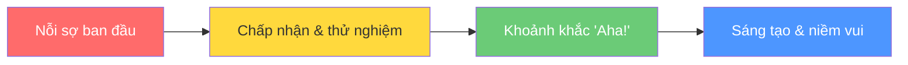
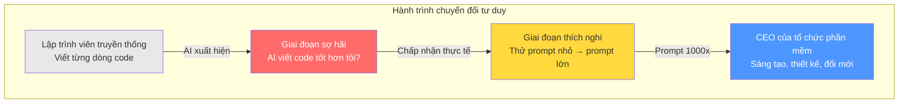

# Bài 1: Tâm sự giữa những lập trình viên — Hãy nói về nỗi sợ

## Nội dung chính

Tôi muốn dành một phút để nói chuyện với bạn, từ một lập trình viên đến một lập trình viên khác.

Tôi là người đã yêu thích lập trình sâu sắc suốt sự nghiệp của mình. Tôi đã khám phá rất nhiều ngôn ngữ — từ C++, Prolog, Java, JavaScript, Clojure cho đến TypeScript. Tôi đã đi sâu vào vẻ đẹp của thiết kế ngôn ngữ, suy nghĩ kỹ lưỡng về từng dòng code, cấu trúc, design patterns... Đó là niềm đam mê sâu sắc trong suốt cuộc đời tôi.

### Nỗi sợ ban đầu

Thành thật mà nói, khi những công cụ AI này xuất hiện, phản ứng đầu tiên của tôi là **cực kỳ sợ hãi**. Và tôi cảm thấy buồn thật sự.

> "Điều này có ý nghĩa gì với tôi — một kỹ sư phần mềm? AI có thể viết code nhanh hơn, và có lẽ tốt hơn tôi với prompting đúng cách. Vậy tất cả những gì tôi đã quan tâm suốt sự nghiệp sẽ đi về đâu?"

Đó là khoảnh khắc nhìn sâu vào bên trong, đầy nỗi buồn và lo lắng.

### Phía bên kia của nỗi sợ

Nhưng tôi muốn nói với bạn rằng — **có một phía bên kia**. Khi bạn vượt qua được, bạn sẽ thấy điều tuyệt vời.

Bây giờ, tôi chưa bao giờ cảm thấy nhiều niềm vui, sáng tạo và thú vị trong công việc xây dựng phần mềm như ngày hôm nay. Và đó là nhờ những gì Generative AI, đặc biệt là Claude Code, có thể làm được.

Claude Code là khoảnh khắc bước ngoặt với tôi — khi tôi bắt đầu lùi lại và đưa ra những prompt lớn hơn như:
- "Xây dựng toàn bộ ứng dụng"
- "Xây dựng toàn bộ tính năng"

Khi tôi tiếp cận theo cách đó, nó đã **thay đổi hoàn toàn** mọi thứ tôi làm trong kỹ thuật phần mềm.

### Sự chuyển đổi

Tôi đã ngừng bị mắc kẹt trong:
- Debug lỗi vặt
- Xử lý phiên bản thư viện
- Tất cả những thứ rác rưởi làm chậm tiến độ
- Những lỗi sai của chính mình

Và bắt đầu được **tập trung vào**:
- Làm sao thực sự giải quyết vấn đề này?
- Làm sao xây dựng ứng dụng thực sự thú vị và đổi mới?

### Điều thực sự quan trọng bây giờ

Điều quan trọng bây giờ là:
- **Sự sáng tạo** (Creativity)
- **Tư duy phản biện** (Critical Thinking)
- **Kiến thức về thiết kế và kiến trúc** (Design & Architecture)
- **Tầm nhìn** — nghĩ ra những thứ thực sự tuyệt vời để xây dựng

### Bước nhảy từ 10x đến 1000x

> Claude Code đã đưa tôi từ mức tăng năng suất 5-10x lên khoảnh khắc tôi đưa ra prompt 1000x — và nó làm điều khiến tôi ngừng thở. Đó là khoảnh khắc tôi nhận ra mình đang ở một thời điểm lịch sử, nơi AI agents và Claude Code đã biến đổi kỹ thuật phần mềm theo cách sẽ có tác động sâu sắc cho phần còn lại của sự nghiệp.

---

## Kiến thức bổ sung: Tâm lý học về sự thay đổi công nghệ

Phản ứng của tác giả rất phổ biến và được gọi là **Technology Grief Cycle** (Chu kỳ đau buồn công nghệ), tương tự mô hình Kübler-Ross:

1. **Denial** (Phủ nhận) — "AI không thể thay thế lập trình viên thực sự"
2. **Anger** (Tức giận) — "Tại sao lại phải thay đổi cách làm việc?"
3. **Bargaining** (Thương lượng) — "Có lẽ tôi chỉ dùng nó cho những việc nhỏ"
4. **Depression** (Buồn bã) — "Kỹ năng của tôi không còn giá trị nữa sao?"
5. **Acceptance** (Chấp nhận) — "Đây là công cụ giúp tôi mạnh hơn"

Điểm mấu chốt: Những lập trình viên vượt qua được giai đoạn này nhanh nhất là những người **chuyển tư duy từ "người viết code" sang "người giải quyết vấn đề"**.

---

## Summary — Đúc rút kinh nghiệm

> **Vai trò của lập trình viên đang thay đổi, không phải biến mất.** Bạn chuyển từ người viết từng dòng code sang người thiết kế, sáng tạo và điều phối. Nỗi sợ ban đầu là hoàn toàn tự nhiên — nhưng phía bên kia của nỗi sợ đó là giai đoạn sáng tạo và năng suất cao nhất trong sự nghiệp. Kỹ năng cốt lõi bây giờ là tư duy phản biện, thiết kế kiến trúc, và khả năng diễn đạt ý tưởng (prompting) — không phải gõ code nhanh. Hãy nghĩ mình là CEO của một tổ chức phát triển phần mềm, không phải một thợ code đơn lẻ.
