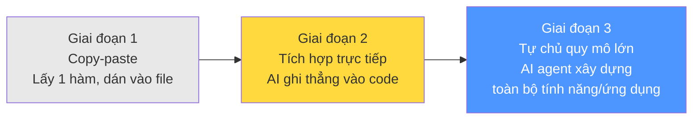
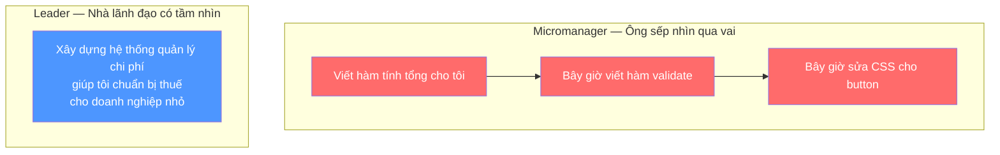
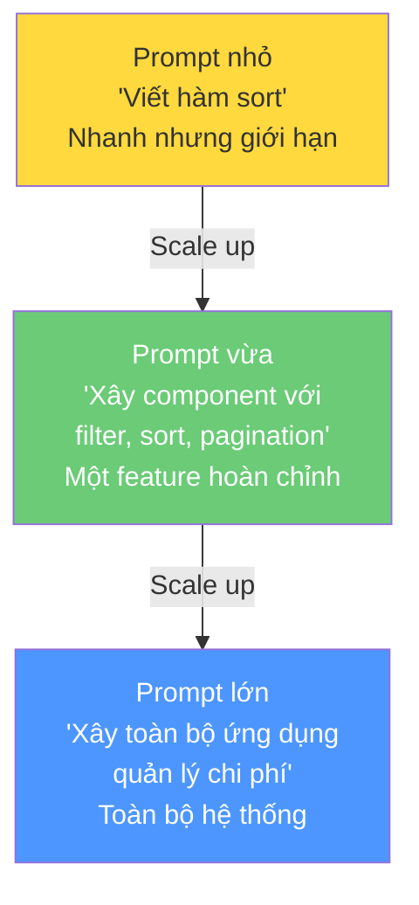

# Bài 2: AI Labor — Claude Code là một đội ngũ phát triển AI

## Nội dung chính

Hy vọng đến giờ bạn đã thử một trong những prompt "điên rồ" kiểu lớn — ít nhất là "xây dựng toàn bộ ứng dụng cho tôi" — và hoàn toàn bị choáng ngợp bởi khả năng của Claude Code.

Bây giờ, tôi muốn lùi lại một bước. Tôi muốn nói về **tại sao prompt lớn lại quan trọng đến vậy**, tại sao cách nghĩ khác về prompting lại quan trọng. Và cũng để đưa ra một mô hình tư duy mà chúng ta sẽ sử dụng xuyên suốt khóa học.

### Mô hình cốt lõi: AI là Lao động (AI is Labor)

Khi bạn sử dụng AI, đặc biệt là AI agent như Claude Code, chúng sẽ **đi làm việc thay bạn**. Đây không phải chatbot — đây là lực lượng lao động phần mềm.

#### Sự tiến hóa của AI Labor

Ban đầu, cuộc cách mạng Generative AI cho chúng ta những mẩu nhỏ lao động AI — đưa prompt, nhận đoạn text, copy-paste vào file. Chúng ta bị mắc kẹt trong thế giới chỉ truy cập được từng chút nhỏ AI labor mỗi lần.

Theo thời gian, chúng ta đã tiến đến chỗ có thể khai thác **ngày càng nhiều lao động hơn** trong mỗi lần tương tác. Và đây chính là lý do prompt lớn quan trọng — vì prompt lớn cho phép chúng ta **tận dụng AI labor ở quy mô lớn**.

### Hai kiểu quản lý AI Labor

| Micromanager | Leader |
|---|---|
| Prompt nhỏ, từng bước một | Prompt lớn, giao tầm nhìn |
| 1 "đồng nghiệp" giỏi viết hàm | 100-1000 "đồng nghiệp" thực hiện tầm nhìn |
| Bạn là bottleneck | AI tự chủ, bạn tập trung sáng tạo |
| Kết quả: 5-10x | Kết quả: 1000x |

### Cách prompt như một Leader

Thay vì micromanage từng chi tiết, hãy:

**1. Thách thức AI với mục tiêu lớn:**
> "Nhìn vào danh sách chi phí này. Làm sao để nó trở nên cực kỳ đẹp, hiện đại và ấn tượng? Hãy khiến tôi ngạc nhiên với sự thanh lịch, đơn giản và đẹp mắt của giao diện."

**2. Giao nhiệm vụ ở cấp hệ thống:**
> "Giao diện không nhất quán. Hãy làm cho mọi thứ khớp với phong cách của danh sách chi phí."

Bạn không chỉ ra từng chi tiết — bạn nói "đi xem xét, tự tìm hiểu, nhưng tôi muốn nó đồng nhất".

**3. Mô tả vấn đề và bối cảnh:**
> "Khi tôi chuẩn bị thuế cho doanh nghiệp nhỏ, tôi thấy rất khó tập hợp tất cả chi phí liên quan. Hãy tạo ra thứ gì đó tuyệt vời để giải quyết vấn đề đó cho tôi."

Chúng ta đang **giao nhiệm vụ cho AI labor** — "Đi giải quyết thách thức này cho tôi" — chứ không phải bảo nó viết một hàm riêng lẻ.

---

## Kiến thức bổ sung: Mô hình AI Labor trong thực tế

### Tại sao mô hình này quan trọng?

Khi bạn nghĩ về AI như "công cụ viết code", bạn sẽ dùng nó như autocomplete cao cấp. Khi bạn nghĩ về AI như "lao động", bạn sẽ:

1. **Thiết kế workflow** — phân chia công việc, giao nhiệm vụ song song
2. **Tối ưu throughput** — không để bản thân thành bottleneck
3. **Tập trung vào giá trị cao** — thiết kế, kiến trúc, review

### Quy tắc ngón tay cái cho prompt size

- **Prompt nhỏ**: Phù hợp khi bạn cần sửa bug cụ thể hoặc viết utility function
- **Prompt vừa**: Xây dựng một feature hoàn chỉnh với nhiều file
- **Prompt lớn**: Xây dựng toàn bộ ứng dụng hoặc hệ thống từ đầu

Mục tiêu là **luôn prompt ở mức lớn nhất có thể** cho ngữ cảnh hiện tại.

---

## Summary — Đúc rút kinh nghiệm

> **AI là lao động, không phải công cụ.** Hãy ngừng micromanage AI bằng prompt nhỏ — đó là cách biến bạn thành bottleneck. Thay vào đó, hãy nghĩ mình là leader giao tầm nhìn cho đội ngũ 1000 developer. Prompt lớn = tận dụng AI labor ở quy mô lớn. Prompt nhỏ = lãng phí tiềm năng. Claude Code không phải chatbot — nó là AI agent, là đội ngũ phát triển của bạn. Hãy giao cho nó thách thức lớn, mô tả vấn đề cần giải quyết, và để nó tự chủ thực hiện.
