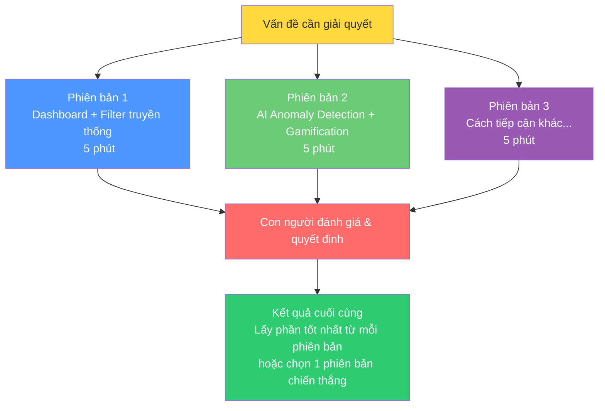
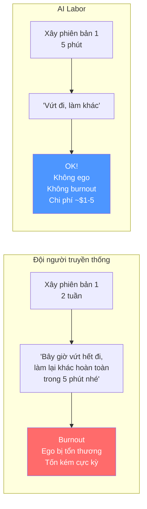
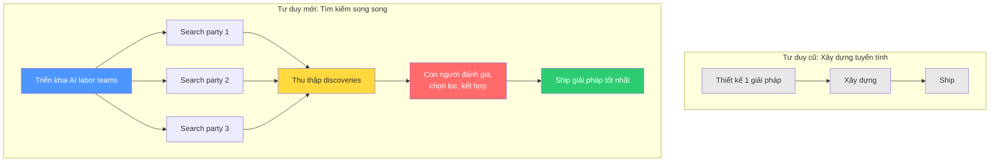

# Bài 3: Pattern "Best of N" — Tận dụng lợi thế chi phí của AI Labor

## Nội dung chính

Nhiều người tin rằng chất lượng code AI khá thấp, tạo ra đầy lỗ hổng bảo mật. Tôi hoàn toàn không đồng ý — và quan trọng hơn, quan điểm đó **đang bỏ lỡ điểm mấu chốt**.

Thứ nhất, cách bạn prompt có ảnh hưởng cực lớn đến chất lượng code đầu ra. Nhưng ngoài prompt, còn rất nhiều kỹ thuật khác cho phép chúng ta viết phần mềm chất lượng cao hơn bao giờ hết.

Điều đó không có nghĩa bạn không cần tham gia. Bạn **phải** tham gia sâu vào kiến trúc, thiết kế và đánh giá. Nhưng vai trò của bạn sẽ khác đi.

### Vấn đề cốt lõi của phần mềm truyền thống

Một trong những lý do phổ biến nhất khiến phần mềm thất bại là:
- **Xây sai thứ** — không đúng nhu cầu thực tế
- **Bỏ lỡ tính năng hay** mà đối thủ nghĩ ra được

Tại sao? Vì xây dựng phần mềm **tốn quá nhiều công sức** nên chúng ta thường:
- Không suy nghĩ đủ kỹ về thiết kế
- Không khám phá đủ các phương án thay thế
- Chỉ đủ sức xây **một phiên bản duy nhất**

### Pattern "Best of N" — Giải pháp với AI Labor

Ý tưởng cốt lõi: **Đừng giải quyết vấn đề một lần. Hãy giải quyết nó 3, 5, 10 lần — rồi chọn cái tốt nhất.**

#### Ví dụ thực tế

Sau khi Claude Code xây xong phiên bản 1 (dashboard + filtering) trong 5 phút, thay vì dừng lại, tác giả prompt tiếp:

> "Tuyệt vời. Bây giờ quay lại branch trước và lặp lại quá trình này, nhưng giải quyết vấn đề gốc theo cách hoàn toàn khác và có giá trị cao. Hãy khiến tôi ngạc nhiên với sự sáng tạo của bạn."

Claude Code tạo phiên bản 2 trên branch mới:
- AI-powered expense anomaly detection
- Gamification
- Social features

Kết quả? Phiên bản 2 thú vị nhưng không phải thứ tác giả muốn → **vứt bỏ toàn bộ**, quay lại phiên bản 1. Nhưng có thể cherry-pick những ý tưởng hay từ phiên bản 2 sang.

### Tại sao điều này gần như bất khả thi với phương pháp truyền thống?

AI Labor có 3 lợi thế then chốt cho pattern này:

| Đặc điểm | Giải thích |
|---|---|
| **Egoless** (Không có cái tôi) | Không buồn, không tức khi bạn vứt bỏ công sức của nó |
| **Không burnout** | Làm đi làm lại không mệt mỏi |
| **Cực rẻ** | Công việc trị giá hàng nghìn đô, chi phí có thể dưới $1-5 |

### Kỹ thuật nâng cao với Best of N

1. **So sánh trực tiếp**: Xây N phiên bản trên N branch, dùng thử tất cả, chọn cái tốt nhất
2. **Cherry-pick**: Lấy phần hay từ phiên bản này ghép vào phiên bản kia
3. **Rubric đánh giá**: Đưa tiêu chí đánh giá cho AI tự pre-evaluate tất cả phiên bản, thu hẹp xuống top 3-4 để bạn review
4. **Merge sáng tạo**: Yêu cầu AI kết hợp điểm mạnh của nhiều phiên bản

### Tư duy mới: Software Engineering as Search

Chúng ta bắt đầu nghĩ về kỹ thuật phần mềm như **tìm kiếm** (search) — triển khai các đội AI labor đi "tìm kiếm" và khám phá các giải pháp khác nhau. Sau đó, con người quyết định giải pháp nào có giá trị nhất, muốn kết hợp chúng ra sao, hay vứt hết và thử hướng hoàn toàn khác.

---

## Kiến thức bổ sung: Best of N trong Machine Learning

Pattern "Best of N" không phải mới — nó có gốc rễ sâu trong ML:

- **Best-of-N sampling** trong LLM: sinh N câu trả lời, dùng reward model chọn câu tốt nhất
- **Ensemble methods**: kết hợp nhiều model để có kết quả tốt hơn bất kỳ model đơn lẻ nào
- **Evolutionary algorithms**: tạo nhiều "cá thể", chọn lọc và lai ghép

Điểm khác biệt ở đây là bạn áp dụng pattern này ở **cấp độ sản phẩm** — không phải cấp model, mà cấp toàn bộ ứng dụng/tính năng.

### Chi phí thực tế

Với Claude Code (API pricing tham khảo):
- Xây 1 ứng dụng hoàn chỉnh: ~$1-5 token cost
- Xây 5 phiên bản khác nhau: ~$5-25
- Giá trị tương đương nếu thuê developer: hàng nghìn đến chục nghìn đô

→ ROI cực cao khi dùng Best of N.

---

## Summary — Đúc rút kinh nghiệm

> **Đừng bao giờ chỉ xây một phiên bản.** AI labor cực rẻ, cực nhanh, và không có ego — hãy tận dụng điều đó. Xây nhiều phiên bản trên nhiều branch, so sánh, cherry-pick phần hay nhất, hoặc yêu cầu AI merge chúng lại. Vai trò của bạn chuyển từ "người xây" sang "người đánh giá và quyết định" — đó mới là nơi giá trị thực sự của con người nằm. Nghĩ về software engineering như search: triển khai nhiều đội AI khám phá song song, rồi bạn chọn hướng tốt nhất.
