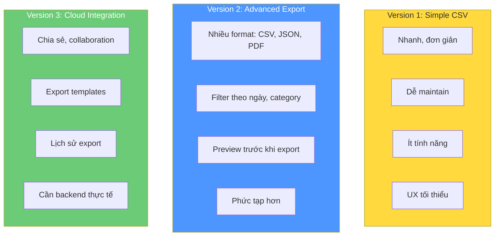
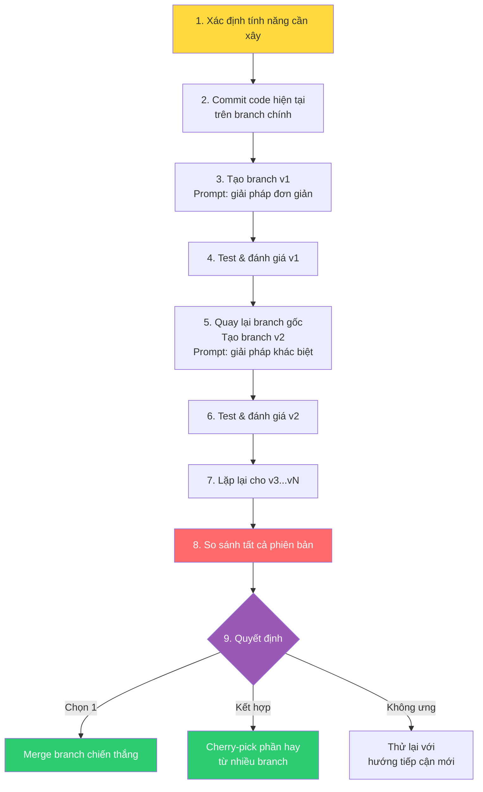

# Bài 4: Bài tập — Xây nhiều phiên bản tính năng với Best of N

## Điều kiện tiên quyết

- Đã hoàn thành Tutorial 1.1 (ứng dụng expense tracking NextJS)
- Hiểu cơ bản về Git branches
- Claude Code đã cài đặt và project expense tracker đang hoạt động

> 💡 Nếu cần học về Git branches, prompt Claude: *"Teach me about Git branches. Let's do it interactively. Don't create an artifact. Explain things using concrete examples with example repositories with a handful of files."*

---

## Phần 1: Hiểu Pattern Best-of-N

### Best-of-N là gì?

Pattern Best-of-N tận dụng lợi thế độc đáo của AI labor: **nhanh, rẻ, và không có ego**. Không giống developer con người, Claude không bực bội khi bạn yêu cầu vứt bỏ công việc và thử lại.

| Phát triển truyền thống | Phát triển với AI Labor |
|---|---|
| Implement 1 giải pháp | Implement 3-5 giải pháp khác nhau |
| Gắn bó với nó (quá tốn kém để viết lại) | So sánh và đánh giá tất cả |
| Hy vọng đó là cách tiếp cận tốt nhất | Chọn cái tốt nhất hoặc kết hợp |
| | Tổng thời gian: vẫn nhanh hơn 1 implementation truyền thống |

### Tại sao pattern này hiệu quả?

- **AI nhanh**: Việc mất vài ngày với con người chỉ mất vài phút với AI
- **AI rẻ**: Ngay cả dùng AI premium vẫn rẻ hơn thời gian developer
- **AI sáng tạo**: Mỗi lần thử có thể khám phá cách tiếp cận hoàn toàn khác
- **AI không có ego**: Không tổn thương khi bạn bỏ đi công việc của nó

---

## Phần 2: Chuẩn bị Repository

```bash
cd expense-tracker-ai
git add .
git commit -m "Initial expense tracker implementation"
git status
```

Khởi động Claude Code:
```bash
claude
```

---

## Phần 3: Phiên bản 1 — Export CSV đơn giản

### Prompt cho Version 1:

```
I want to add data export functionality to my expense tracker.
For this first version, implement a SIMPLE approach.

VERSION CONTROL:
- Before you start, create a new branch called "feature-data-export-v1"
- Make all your changes in this branch
- Commit your changes when complete

VERSION 1 REQUIREMENTS:
- Add an "Export Data" button to the main dashboard
- When clicked, export all expenses as a CSV file
- Include columns: Date, Category, Amount, Description
- Use a simple, straightforward implementation
- Keep the UI minimal - just a button that triggers the download

IMPLEMENTATION APPROACH:
Focus on simplicity and getting it working quickly. Don't overthink
the user experience - just make it functional. Use standard browser
APIs for file download.

PROCESS:
1. Create and checkout the new branch "feature-data-export-v1"
2. Implement the CSV export functionality
3. Add the export button to the dashboard
4. Test that it works correctly
5. Commit your changes with a descriptive message

Remember: This is Version 1 of 3 - keep it simple and functional.
```

### Quan sát khi Claude làm việc:
- Cách nó tạo branch
- Cách tiếp cận (có thể dùng browser APIs)
- Sự đơn giản của implementation
- Vị trí đặt nút Export
- Cách format dữ liệu CSV

### Test Version 1:
```bash
npm run dev
# Thêm vài expenses test
# Click nút Export
# Kiểm tra file CSV download và mở đúng
```

---

## Phần 4: Phiên bản 2 — Export nâng cao với nhiều tùy chọn

### Prompt cho Version 2:

```
Excellent work on Version 1! Now I want you to implement the SAME
data export feature in a completely different way.

VERSION CONTROL:
- Switch back to the original branch (before any export functionality)
- Create a new branch called "feature-data-export-v2"
- This should be a completely fresh implementation

VERSION 2 REQUIREMENTS:
Implement an ADVANCED export system with these features:
- Export modal/dialog with multiple options
- Multiple export formats: CSV, JSON, and PDF
- Date range filtering for exports (start date, end date)
- Category filtering for exports (select specific categories)
- Preview of data before export
- Custom filename input field
- Export summary showing how many records will be exported
- Loading states during export process

IMPLEMENTATION APPROACH:
This version should feel like a professional business application
export feature. Think about what a power user would want - lots of
control and options. Use a modal or drawer interface, not just a
simple button.

Make this implementation completely different from Version 1:
- Different UI components and patterns
- Different user experience flow
- More sophisticated code architecture
- Professional polish and attention to detail

PROCESS:
1. Switch back to original branch
2. Create and checkout: git checkout -b feature-data-export-v2
3. Implement the advanced export system
4. Test all the functionality thoroughly
5. Commit your changes

Show me what's possible with a more sophisticated approach. Be creative!
```

---

## Phần 5: Phiên bản 3 — Tích hợp Cloud

### Prompt cho Version 3:

```
Great work on Version 2! Now let's try a third completely different
approach to the same export feature.

VERSION CONTROL:
- Switch back to the original branch (clean state, no export features)
- Create branch "feature-data-export-v3"

VERSION 3 REQUIREMENTS:
Implement a CLOUD-INTEGRATED export system with these features:
- Email export functionality (simulated - show UI flow)
- Google Sheets integration mockup
- Automatic backup scheduling options
- Export history tracking (show previous exports with timestamps)
- Sharing capabilities - generate shareable links or QR codes
- Export templates ("Tax Report", "Monthly Summary", "Category Analysis")
- Integration mockups with popular tools (Dropbox, OneDrive, etc.)
- Cloud storage options and sync status indicators

IMPLEMENTATION APPROACH:
Think like a modern SaaS application - focus on connectivity, sharing,
and integration. Even if simulating some integrations, make the UI
and user flow feel like a real cloud service.

This should feel completely different from both Version 1 and Version 2:
- Modern cloud service aesthetic
- Focus on sharing and collaboration
- Integration-first mindset
- Background processing concepts

Think big picture - how would a company like Notion or Airtable
approach this feature?
```

---

## Phần 6: So sánh 3 phiên bản

### Chuyển đổi giữa các branch:

```bash
# Xem tất cả branches
git branch -a

# Chuyển sang Version 1
git checkout feature-data-export-v1
npm run dev
# Test export CSV đơn giản

# Chuyển sang Version 2
git checkout feature-data-export-v2
npm run dev
# Test modal nâng cao với nhiều tùy chọn

# Chuyển sang Version 3
git checkout feature-data-export-v3
npm run dev
# Test tính năng cloud integration
```

### So sánh 3 phiên bản



---

## Kiến thức bổ sung: Workflow thực tế với Best of N

### Quy trình đề xuất



### Mẹo thực hành

1. **Luôn commit trước khi bắt đầu** — đảm bảo có điểm quay lại sạch
2. **Mỗi phiên bản trên branch riêng** — dễ so sánh và chuyển đổi
3. **Prompt khác nhau thật sự** — không chỉ thay đổi nhỏ, mà thay đổi triết lý thiết kế
4. **Test thực tế mỗi phiên bản** — không chỉ đọc code, mà dùng thử
5. **Ghi chú điểm hay/dở** của mỗi phiên bản để quyết định cuối cùng

---

## Summary — Đúc rút kinh nghiệm

> **Bài tập này minh họa sức mạnh thực tế của Best of N**: cùng một tính năng (data export), 3 cách tiếp cận hoàn toàn khác nhau — từ đơn giản (CSV button) đến chuyên nghiệp (modal nâng cao) đến hiện đại (cloud integration). Mỗi phiên bản mất vài phút, tổng cộng vẫn nhanh hơn xây 1 phiên bản theo cách truyền thống. Git branches là công cụ then chốt — mỗi phiên bản sống trên branch riêng, dễ so sánh, cherry-pick, hoặc vứt bỏ. Đây là workflow bạn nên áp dụng cho mọi tính năng quan trọng.
