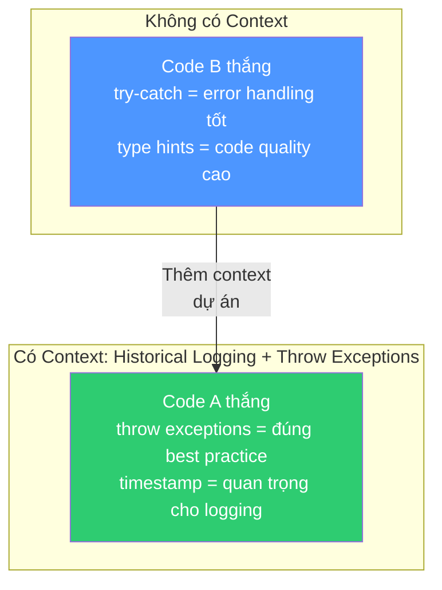
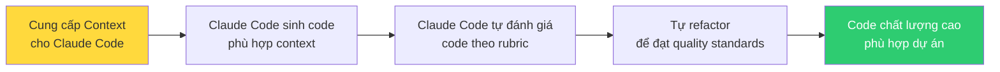

# Bài 1: AI có thể đánh giá chất lượng code không?

## Nội dung chính

Nếu chúng ta muốn lùi lại và thực sự để Claude Code làm việc ở quy mô lớn, chúng ta phải **tin tưởng** rằng nó có thể tạo ra code chất lượng cao.

Một điều quan trọng tôi đã học được: khả năng **tạo ra** code chất lượng cao được thúc đẩy bởi khả năng **nhận biết** code chất lượng cao — đánh giá code, phát hiện vấn đề, tìm chỗ cải thiện, phát hiện cơ hội refactor.

> Khả năng đánh giá code là nền tảng cốt lõi để tạo ra code tốt.

Vậy nếu muốn Claude Code thực sự đáng tin cậy, chúng ta phải chứng minh rằng nó **biết cách đánh giá code và hiểu code**.

### Thí nghiệm: Tự tạo rubric đánh giá

Tác giả yêu cầu Claude:

> "Tôi sẽ cho Claude Code viết nhiều giải pháp khác nhau cho prompt này: Viết một hàm Python 20 dòng có thể lưu dữ liệu nhận được dưới dạng JSON. Hãy tạo bảng chấm điểm các giải pháp code theo nhiều chiều quan trọng."

Claude tự tạo ra rubric với các tiêu chí:

| Tiêu chí | Mô tả |
|---|---|
| Functionality | Chức năng hoạt động đúng |
| Error Handling | Xử lý lỗi |
| Code Quality | Chất lượng code (type hints, cấu trúc) |
| Flexibility | Tính linh hoạt |
| Performance | Hiệu suất |
| Documentation | Tài liệu |
| Security | Bảo mật |
| Maintainability | Khả năng bảo trì |
| Line Efficiency | Hiệu quả số dòng |
| Best Practices | Thực hành tốt nhất |

Mỗi tiêu chí có trọng số (weight) và thang điểm /5.

### Thí nghiệm: Áp dụng rubric vào code thực

Tác giả lấy 2 mẫu code (Solution A và Solution B), yêu cầu Claude chấm điểm theo rubric đã tạo.

Kết quả ban đầu (không có context):

| Tiêu chí | Winner | Lý do |
|---|---|---|
| Error Handling | **B** | Có try-except blocks toàn diện, feedback lỗi có ý nghĩa |
| Code Quality | **B** | Có type hints, cấu trúc sạch hơn |
| Flexibility | **A** | Có tham số tùy chọn (timestamp, default filename) |
| **Tổng kết** | **B thắng** | Error handling và tuân thủ ràng buộc vượt trội hơn flexibility của A |

### Bước ngoặt: Context thay đổi mọi thứ

Tác giả thêm context:

> "Nhân tiện, đây là cho hệ thống ghi log lịch sử và chúng ta cần đảm bảo capture mọi thứ. Best practices của dự án: luôn throw exceptions, và timing là yếu tố quan trọng."

Claude phản hồi ngay lập tức:

> "Context này thay đổi đáng kể việc đánh giá."

Kết quả sau khi có context:

| Tiêu chí | Trước | Sau | Lý do thay đổi |
|---|---|---|---|
| Error Handling | B (5/5) | **A (5/5)** | A throw exceptions (đúng best practice), B nuốt exception bằng try-catch (sai!) |
| Flexibility | A | **A (mạnh hơn)** | Timestamp feature quan trọng cho historical logging |
| **Tổng kết** | B thắng | **A thắng** | Hoàn toàn đảo ngược! |

### Ý nghĩa quan trọng

Điều này chứng minh 2 điều:

1. **AI có thể đánh giá code** — không chỉ ở mức syntax mà ở mức thiết kế, flexibility, best practices (những đánh giá "cấp con người")
2. **Context quyết định tất cả** — cùng một đoạn code, đánh giá hoàn toàn đảo ngược khi có context khác nhau

### Ứng dụng thực tế

Bạn có thể:
- Đưa rubric đánh giá cho Claude Code và nói: "Đây là cách tôi muốn bạn đánh giá code. Hãy xem xét tất cả điều này khi bạn viết code."
- Yêu cầu Claude Code tự introspect code của nó và refactor theo tiêu chuẩn chất lượng của bạn
- Giải quyết vấn đề **tính nhất quán** — khi code sinh ra không đúng mong đợi

---

## Kiến thức bổ sung: Code Review tự động với AI

### Các chiều đánh giá code phổ biến

Rubric mà Claude tạo ra khá sát với các tiêu chuẩn code review trong ngành:

1. **Correctness** — Code có làm đúng việc không?
2. **Readability** — Người khác có đọc hiểu được không?
3. **Maintainability** — Có dễ sửa đổi trong tương lai không?
4. **Performance** — Có hiệu quả về tài nguyên không?
5. **Security** — Có lỗ hổng bảo mật không?
6. **Testability** — Có dễ viết test không?

### Context quan trọng cần cung cấp

Để AI đánh giá code chính xác, bạn cần cung cấp:
- **Project conventions** — coding style, naming conventions
- **Best practices riêng** — throw vs catch exceptions, logging strategy
- **Use case** — hệ thống real-time vs batch processing
- **Non-functional requirements** — performance targets, security requirements
- **Team standards** — review checklist, definition of done

---

## Summary — Đúc rút kinh nghiệm

> **AI hoàn toàn có khả năng đánh giá chất lượng code** — không chỉ ở mức cú pháp mà ở mức thiết kế, flexibility, và best practices. Nhưng chất lượng đánh giá phụ thuộc hoàn toàn vào context bạn cung cấp. Cùng một đoạn code có thể được chấm 5/5 hoặc 1/5 tùy vào context dự án. Đây là bài học then chốt: muốn Claude Code sinh code tốt, hãy cho nó đủ context — project conventions, best practices, use case cụ thể. Và bạn có thể đưa rubric đánh giá để Claude Code tự kiểm tra và refactor code của chính nó.
