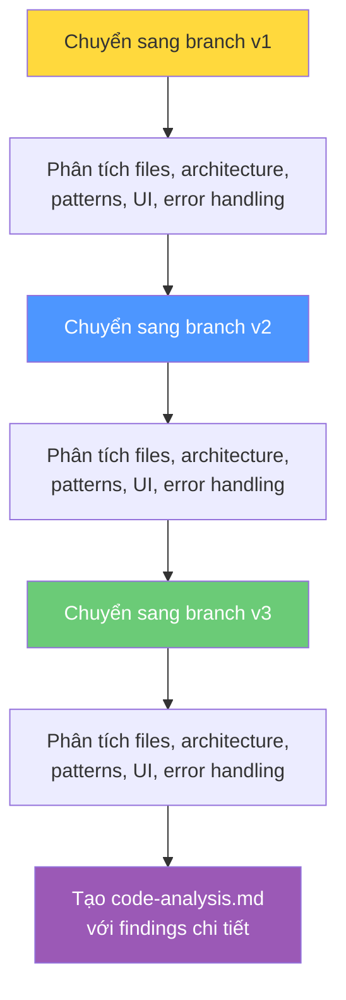
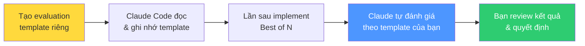
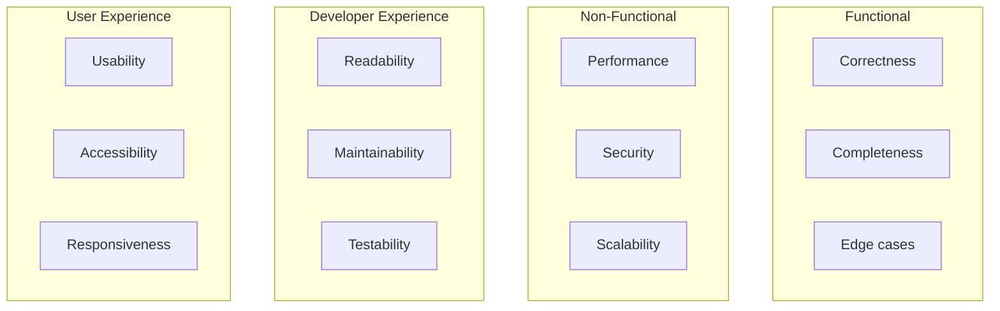

# Bài 2: Bài tập — AI đánh giá Code & các Implementation tính năng

## Điều kiện tiên quyết

- Đã hoàn thành Tutorial 2.2 (Pattern Best-of-N)
- Có 3 implementation khác nhau của tính năng data export trên 3 git branch riêng
- Hiểu cơ bản về nguyên tắc đánh giá code
- Claude Code đã cài đặt và hoạt động

---

## Phần 1: Tại sao đánh giá Code quan trọng trong phát triển với AI

### Thách thức mới

Khi làm việc với AI labor, bạn thường có **nhiều giải pháp hoạt động được** để chọn. Không giống phát triển truyền thống nơi bạn thường chỉ xây 1 phiên bản, tốc độ của AI cho phép khám phá nhiều cách tiếp cận. Nhưng điều này tạo ra thách thức mới: **Làm sao đánh giá và so sánh có hệ thống?**

| Phát triển truyền thống | Phát triển với AI |
|---|---|
| Đánh giá 1 giải pháp so với các phương án lý thuyết | Đánh giá nhiều implementation thực tế |
| Quyết định dựa trên kinh nghiệm và trực giác | So sánh code thực, không phải lý thuyết |
| Khả năng test các cách tiếp cận khác nhau bị giới hạn | Test trải nghiệm người dùng thực tế song song |
| Chi phí đổi hướng cao | Quyết định dựa trên dữ liệu về kiến trúc |

---

## Phần 2: Thiết lập đánh giá có hệ thống

### Bước 1: Kiểm tra các implementation

```bash
cd expense-tracker-ai
git branch -a
```

Bạn cần thấy:
- `main`
- `feature-data-export-v1` (Export CSV đơn giản)
- `feature-data-export-v2` (Export nâng cao với tùy chọn)
- `feature-data-export-v3` (Tích hợp cloud)

### Bước 2: Khởi động Claude Code

```bash
claude
```

### Bước 3: Tạo & thực thi đánh giá

Prompt cho Claude Code:

```
I have three different implementations of data export functionality
across three git branches in my expense tracker application. I want
to create a systematic evaluation framework to compare them thoroughly.

BACKGROUND:
- feature-data-export-v1: Simple CSV export (one-button approach)
- feature-data-export-v2: Advanced export with multiple formats
  and filtering options
- feature-data-export-v3: Cloud integration with sharing and
  collaboration features

Now I want you to systematically analyze each of three features
implementations by switching between branches and examining the code,
architecture, and implementation details.

ANALYSIS PROCESS:
For each branch (v1, v2, v3), please:
1. Switch to the branch
2. Examine all the files that were created or modified
3. Analyze the code architecture and patterns used
4. Look at component structure and organization
5. Review the user interface implementation
6. Check for error handling and edge cases
7. Assess the technical approach and libraries used

DOCUMENTATION:
Create a file called "code-analysis.md" with detailed findings
for each version:

**For Each Version, Document:**
- Files created/modified (list them)
- Code architecture overview (how is it organized?)
- Key components and their responsibilities
- Libraries and dependencies used
- Implementation patterns and approaches
- Code complexity assessment
- Error handling approach
- Security considerations
- Performance implications
- Extensibility and maintainability factors

**Technical Deep Dive:**
- How does the export functionality work technically?
- What file generation approach is used?
- How is user interaction handled?
- What state management patterns are used?
```

### Quy trình Claude Code sẽ thực hiện:



---

## Phần 3: Review kết quả phân tích

Sau khi Claude hoàn thành, review file `code-analysis.md` để thấy bức tranh toàn cảnh:
- 3 cách tiếp cận khác nhau **thực sự khác nhau đến mức nào**?
- Sự khác biệt lớn về kiến trúc, độ phức tạp, triết lý implementation?
- Bạn có thực sự khám phá các không gian giải pháp khác nhau, hay chỉ tạo biến thể của cùng một cách tiếp cận?

---

## Phần 4: Xây dựng Evaluation Framework cá nhân

Claude có framework đánh giá mặc định khá toàn diện, nhưng bạn có thể có **tiêu chí riêng** quan trọng cho dự án, team, hoặc ngành của mình.

### Tạo template đánh giá riêng

Tạo file `my-evaluation-template.md` với các tiêu chí quan trọng nhất với bạn. Ví dụ:

```markdown
# My Evaluation Template

## Tiêu chí bắt buộc (Must-have)
- [ ] Accessibility (WCAG compliance)
- [ ] Mobile responsive
- [ ] Error handling cho edge cases
- [ ] Performance < 200ms response time

## Tiêu chí ưu tiên (Nice-to-have)
- [ ] Offline support
- [ ] Internationalization ready
- [ ] Analytics integration

## Scoring (1-5)
- Code readability: __/5
- Test coverage: __/5
- UX quality: __/5
- Maintainability: __/5
```

Sau đó, bảo Claude Code:

> "Đọc file my-evaluation-template.md và áp dụng framework đánh giá đó cho lần tiếp theo tôi yêu cầu bạn implement nhiều phiên bản của một tính năng."



---

## Kiến thức bổ sung: Framework đánh giá code trong thực tế

### Các chiều đánh giá phổ biến trong ngành



### Mẹo đánh giá hiệu quả

1. **Đừng chỉ đọc code — hãy dùng thử**: Chạy mỗi phiên bản, tương tác thực tế
2. **Đánh giá theo context dự án**: Một giải pháp đơn giản có thể tốt hơn giải pháp phức tạp nếu dự án cần ship nhanh
3. **Xem xét chi phí bảo trì dài hạn**: Code phức tạp hôm nay = nợ kỹ thuật ngày mai
4. **Hỏi ý kiến team**: Nếu làm việc nhóm, chia sẻ các phiên bản để cùng đánh giá

---

## Summary — Đúc rút kinh nghiệm

> **Khi AI cho phép xây nhiều phiên bản, kỹ năng đánh giá code trở thành kỹ năng cốt lõi.** Hãy xây dựng evaluation framework riêng phù hợp với dự án và team của bạn. Để Claude Code tự phân tích code trên từng branch — nó sẽ tạo báo cáo chi tiết về kiến trúc, patterns, và trade-offs. Nhưng quyết định cuối cùng luôn thuộc về bạn — con người đánh giá, không phải AI. Lưu template đánh giá để tái sử dụng cho mọi lần Best of N trong tương lai.
