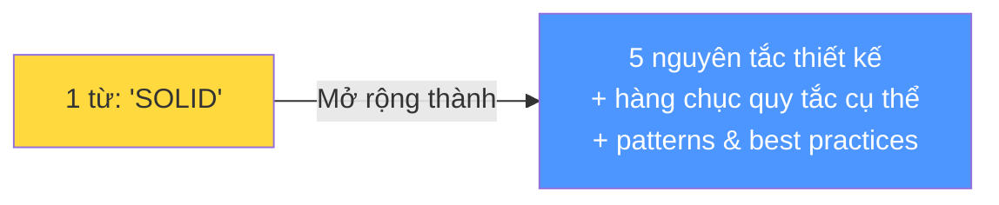
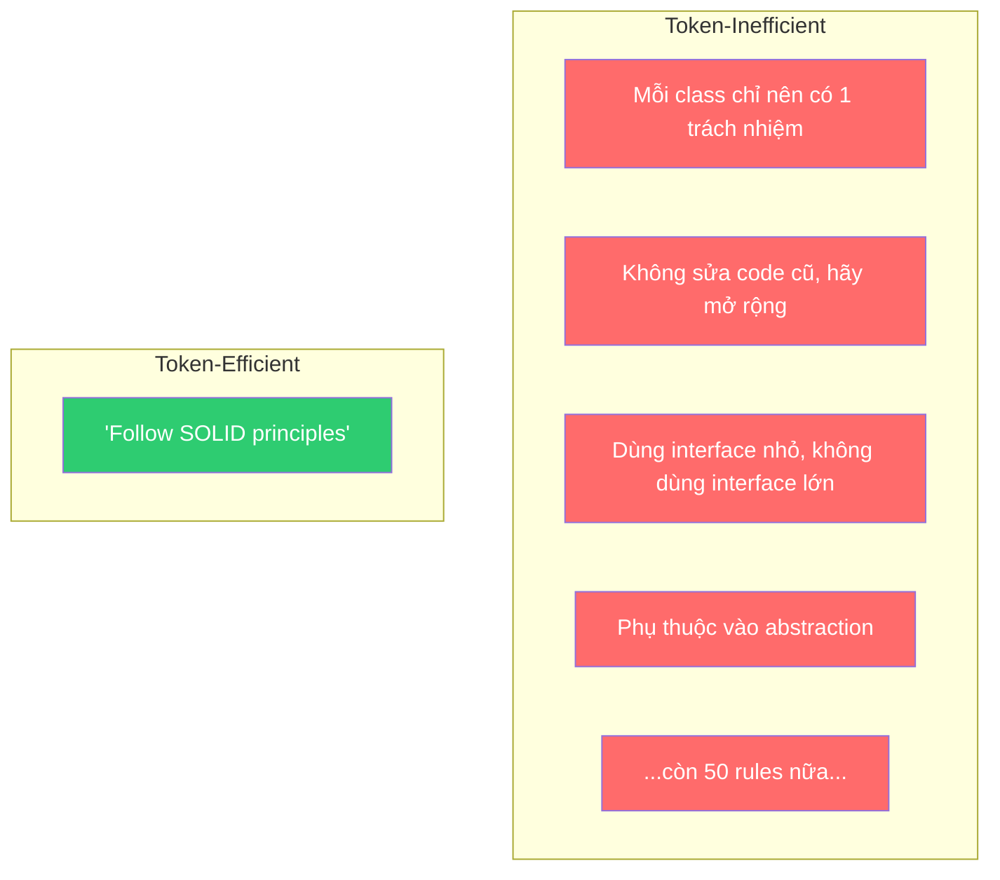
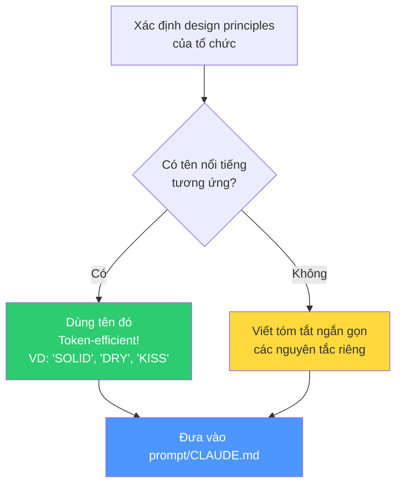

# Bài 3: AI Labor có hiểu Design Principles không?

## Nội dung chính

Trước khi kết thúc phần thảo luận về chất lượng code, tôi muốn nói về **thiết kế** — tất cả những "ilities" mà chúng ta quan tâm trong phần mềm: extensibility, modularity, reusability...

Câu hỏi: **AI có thể hiểu chúng không? Claude Code có hiểu chúng không?**

Câu trả lời: **Hoàn toàn có.**

### Tại sao điều này quan trọng?

Thường thì việc diễn đạt **nguyên tắc thiết kế cấp cao** hiệu quả hơn nhiều so với việc liệt kê hàng trăm rules cụ thể. Thay vì viết ra tất cả các quy tắc chi tiết cho code (rất tốn thời gian), bạn chỉ cần nói: "Hãy áp dụng bộ nguyên tắc cấp cao này."

### Thí nghiệm: SOLID Principles

Tác giả hỏi Claude: "Bạn có biết SOLID design principles không?"

Claude trả lời ngay lập tức:

| Chữ cái | Nguyên tắc | Ý nghĩa |
|---|---|---|
| **S** | Single Responsibility Principle | Mỗi class/module chỉ có một lý do để thay đổi |
| **O** | Open/Closed Principle | Mở cho mở rộng, đóng cho sửa đổi |
| **L** | Liskov Substitution Principle | Object con có thể thay thế object cha mà không phá vỡ chương trình |
| **I** | Interface Segregation Principle | Nhiều interface nhỏ tốt hơn một interface lớn |
| **D** | Dependency Inversion Principle | Phụ thuộc vào abstraction, không phụ thuộc vào implementation cụ thể |

### Sức mạnh của "Token-Efficient Instructions"

Chỉ cần nói **"SOLID"** — một từ duy nhất — Claude đã biết toàn bộ hệ thống nguyên tắc phía sau. Đây là khái niệm **token-efficient instruction**: chỉ dẫn có hiệu suất token cao.

Mỗi instruction bạn đưa cho AI đều tốn token. Bạn muốn những instruction **ngắn gọn nhưng có sức mạnh thực sự**.

### Chứng minh: Refactor theo SOLID

Tác giả yêu cầu: "Refactor Solution A để trở thành mẫu mực cho các nguyên tắc này."

Claude thực hiện:
- Chuyển code sang hướng đối tượng (vì SOLID ngụ ý OOP)
- Tạo các component nhỏ, mỗi cái có **single responsibility**
- Xây dựng DataStore bằng cách **compose** các component nhỏ lại
- Code mở rộng đáng kể nhưng modular và tuân thủ SOLID hoàn toàn

→ Claude không chỉ "biết" SOLID trên lý thuyết — nó **áp dụng được** vào code thực tế.

### Chiến lược: Tìm "Power Words" cho AI

Khi nghĩ về cách diễn đạt yêu cầu cho Claude Code, hãy tự hỏi:

1. **Nguyên tắc thiết kế cốt lõi** của tổ chức bạn là gì?
2. Có **tên gọi nổi tiếng** nào gần với những nguyên tắc đó không?
3. Có thể dùng tên đó làm **shortcut hiệu quả** thay vì liệt kê hàng trăm rules?

---

## Kiến thức bổ sung: Các Design Principles phổ biến mà AI hiểu tốt

Đây là những "power words" bạn có thể dùng — mỗi từ mở rộng thành hệ thống nguyên tắc phong phú:

| Tên | Viết tắt | Ý nghĩa cốt lõi |
|---|---|---|
| SOLID | S.O.L.I.D | 5 nguyên tắc OOP (đã nêu trên) |
| DRY | Don't Repeat Yourself | Không lặp lại logic |
| KISS | Keep It Simple, Stupid | Giữ đơn giản |
| YAGNI | You Aren't Gonna Need It | Không xây thứ chưa cần |
| Clean Architecture | — | Tách biệt layers, dependency rule |
| Domain-Driven Design | DDD | Thiết kế theo domain business |
| Twelve-Factor App | 12-Factor | 12 nguyên tắc cho SaaS apps |
| CQRS | Command Query Responsibility Segregation | Tách đọc và ghi |
| Event Sourcing | — | Lưu events thay vì state |
| Hexagonal Architecture | Ports & Adapters | Tách core logic khỏi infrastructure |

Mỗi cái chỉ cần 1-3 từ nhưng mở rộng thành hàng chục quy tắc cụ thể mà Claude đã được train để hiểu.

### Kết hợp nhiều principles

Bạn có thể kết hợp:

> "Follow SOLID principles, apply Clean Architecture with DDD patterns, and keep YAGNI in mind."

Một câu ngắn nhưng chứa đựng hàng trăm quy tắc thiết kế cụ thể.

---

## Summary — Đúc rút kinh nghiệm

> **AI hiểu sâu các design principles — không chỉ lý thuyết mà áp dụng được vào code thực.** Hãy tận dụng điều này bằng "token-efficient instructions": thay vì liệt kê hàng trăm rules, dùng tên nguyên tắc nổi tiếng (SOLID, DRY, Clean Architecture...) — Claude biết chính xác chúng nghĩa là gì. Đây là cách hiệu quả nhất để nâng chất lượng code: cho Claude Code biết bạn sống theo nguyên tắc thiết kế nào, và nó sẽ sinh code phù hợp. Nếu tổ chức bạn có nguyên tắc riêng, hãy tìm tên gọi nổi tiếng gần nhất hoặc viết tóm tắt ngắn gọn.
