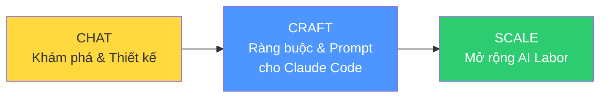
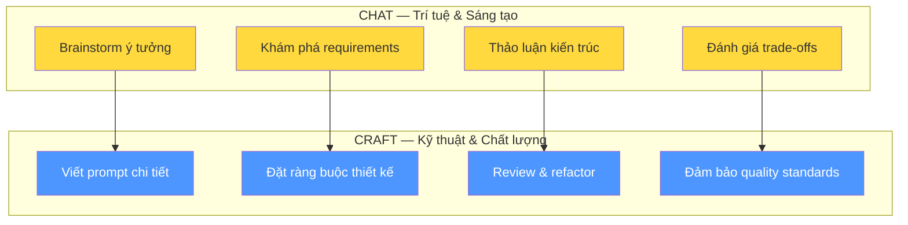
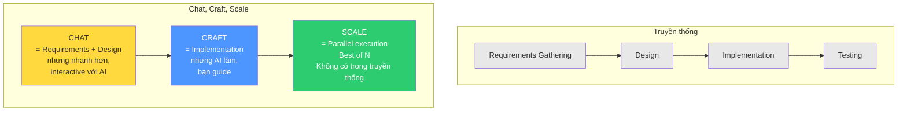
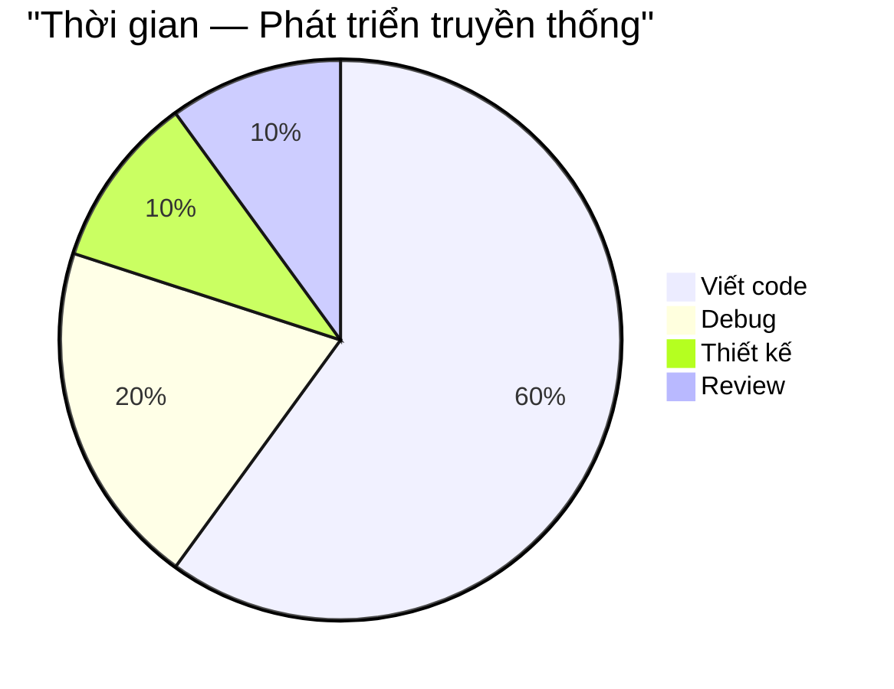
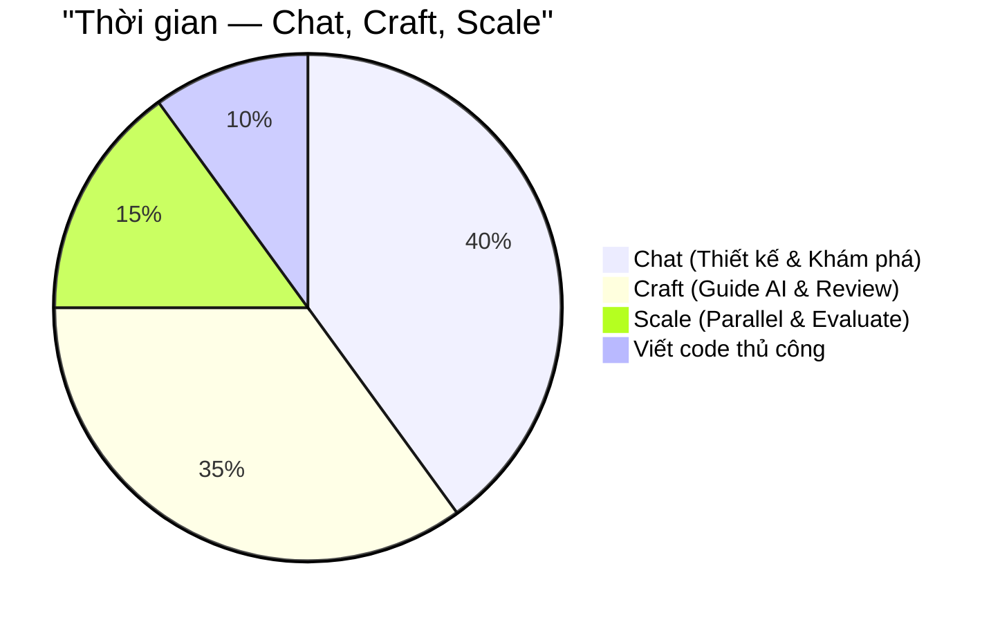

# Bài 4: Chat, Craft, Scale — Dành nhiều thời gian hơn cho Thiết kế & Đổi mới

## Nội dung chính

Vậy chúng ta đã biết cách viết prompt lớn. Thế là xong đúng không? Chỉ cần đưa Claude Code prompt lớn và nghỉ ngơi?

**Rất may là không dễ như vậy.** Và chính vì nó không dễ như vậy — đó là nơi kỹ sư phần mềm trở nên quan trọng.

### Sự thay đổi vai trò

Ban đầu tôi cảm thấy mất mát — không còn được mày mò từng dòng code. Nhưng rồi tôi nhận ra: tôi **thực sự phải tập trung vào kiến trúc**. Vì:

- Generative AI có **sự biến thiên rất lớn** trong cách viết code
- Chúng ta phải là **người dẫn đường** — chỉ ra hướng đi đúng, kiến trúc đúng

Tôi bắt đầu dành **nhiều thời gian hơn cho thiết kế**, suy nghĩ kỹ hơn về những gì mình đang làm, và **không sợ refactor**, cải thiện, thử nhiều cách khác nhau.

### Mục tiêu thực sự

> Mục tiêu không chỉ là **nhanh hơn**. Mục tiêu là **chất lượng cao hơn**.

Bạn có thể làm mọi thứ nhanh hơn — đúng. Nhưng bạn muốn **chất lượng cao hơn**: code tốt hơn, ứng dụng tốt hơn, sản phẩm tốt hơn.

### Hệ thống Chat, Craft, Scale

Tác giả đã phát triển một hệ thống tiếp cận riêng gồm 3 giai đoạn:

| Giai đoạn | Mục đích | Hoạt động chính |
|---|---|---|
| **Chat** | Khám phá, thiết kế, sáng tạo | Trò chuyện với AI để brainstorm, khám phá requirements, thiết kế kiến trúc |
| **Craft** | Xây dựng với chất lượng | Tạo ràng buộc, viết prompt chi tiết cho Claude Code, đảm bảo code đúng hướng |
| **Scale** | Mở rộng quy mô | Triển khai AI labor song song, Best of N, tự động hóa |

### Chat & Craft — Nơi sự sáng tạo nằm

Khóa học sẽ tập trung vào **Chat** và **Craft** trước — đây là phần tác giả hào hứng nhất:

Phần **Scale** sẽ được học sau — bao gồm các kỹ thuật mở rộng AI labor, làm việc song song, và tự động hóa quy trình phát triển.

---

## Kiến thức bổ sung: So sánh với các phương pháp phát triển phần mềm

### Chat, Craft, Scale vs. Phương pháp truyền thống

Hệ thống này có sự tương đồng với các phương pháp phát triển đã biết, nhưng được tối ưu cho workflow với AI:

Điểm khác biệt lớn nhất:
- **Chat** gộp requirements + design thành quá trình interactive, nhanh hơn nhiều
- **Craft** chuyển implementation từ "bạn viết code" sang "bạn guide AI viết code"
- **Scale** là giai đoạn hoàn toàn mới — không tồn tại trong phát triển truyền thống

### Phân bổ thời gian thay đổi

---

## Summary — Đúc rút kinh nghiệm

> **Prompt lớn chỉ là bước đầu — không phải tất cả.** Sự biến thiên trong output của AI đòi hỏi bạn phải là người dẫn đường về kiến trúc và thiết kế. Hệ thống Chat, Craft, Scale cho bạn framework rõ ràng: Chat để khám phá và thiết kế (phần sáng tạo nhất), Craft để xây dựng với ràng buộc chất lượng, Scale để mở rộng AI labor. Mục tiêu cuối cùng không phải nhanh hơn — mà là chất lượng cao hơn. Thời gian bạn tiết kiệm được từ việc không viết code thủ công nên được đầu tư vào thiết kế, đánh giá, và đổi mới.
