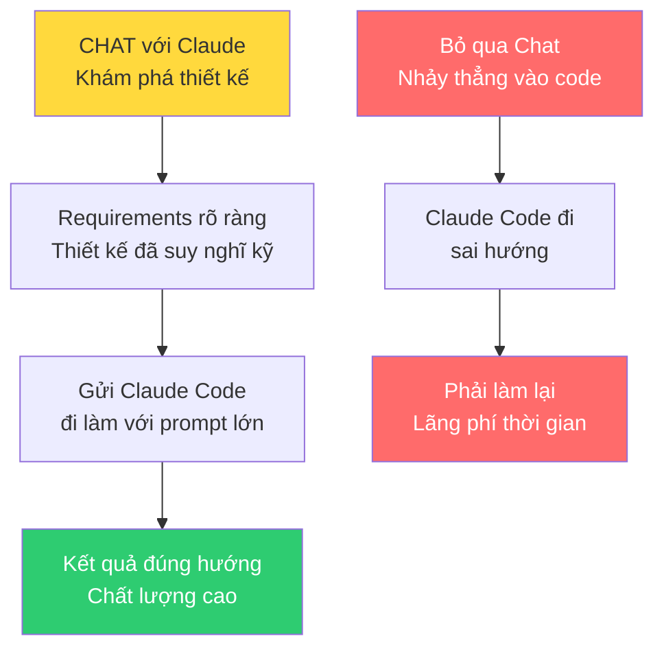
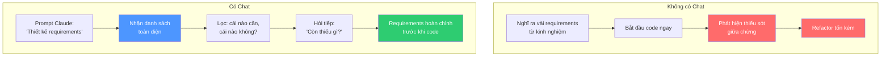
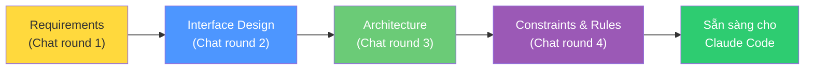

# Bài 5: Chat — Khám phá Requirements & Các lựa chọn thiết kế

## Nội dung chính

### Chat là gì?

Chat là quá trình **suy nghĩ kỹ về thiết kế thông qua hội thoại**.

Hãy nghĩ về những gì bạn làm khi làm việc với đồng nghiệp — đi uống cà phê, nói chuyện về thiết kế, thảo luận các cách tiếp cận khác nhau. Bạn vẫn có thể làm điều đó. Nhưng bây giờ bạn có thêm một "đồng nghiệp" cực kỳ am hiểu để giúp bạn suy nghĩ qua mọi chiều của thiết kế.

### Tại sao Chat là thay đổi quan trọng nhất?

> Đây có lẽ là thay đổi quan trọng nhất bạn cần thực hiện trong quy trình phát triển.

Khi bạn tiết kiệm được thời gian nhờ prompt lớn, điều cực kỳ quan trọng là **trước khi gửi Claude Code đi làm**, bạn phải đảm bảo:
- Gửi nó đi **đúng hướng**
- Có **thiết kế đúng** trong đầu

Vì một khi bạn "thả" nó ra — đặc biệt khi bạn muốn lùi lại và không micromanage — bạn gặp vấn đề: **Làm sao đảm bảo nó đi đúng hướng?**

Câu trả lời: **Thông qua thiết kế** — suy nghĩ kỹ về requirements, cách đặc tả, đảm bảo bạn đã thực sự hiểu rõ vấn đề.

### Ví dụ thực tế: Thiết kế API Wrapper cho Claude Code

Tác giả bắt đầu với prompt đơn giản trong Claude (không phải Claude Code):

> "Hãy thiết kế requirements cho một wrapper xung quanh Claude Code. Nó sẽ expose Claude Code dưới dạng API qua HTTP, được gọi trên server. Hãy đưa ra bộ requirements ban đầu."

Claude trả về danh sách requirements phong phú:

| Nhóm | Ví dụ requirements |
|---|---|
| Core Functionality | RESTful API với endpoints dựa trên resource, hỗ trợ sync & async execution |
| Execution | Thực thi code tasks qua HTTP, stream logs & progress real-time |
| Auth & Security | Authentication, authorization, rate limiting |
| Task Management | Queue, priority, status tracking |
| Infrastructure | Scaling, monitoring, health checks |
| Developer Experience | SDK, documentation, sandbox environment |
| Metrics | API usage tracking, performance monitoring |

### Giá trị của Chat trong khám phá Requirements

Điều tuyệt vời:
1. Claude **phơi bày nhiều chiều** của vấn đề mà bạn có thể chưa nghĩ tới ngay (ví dụ: metrics cho API usage)
2. Bạn có danh sách lớn để **lọc ngược** — "cái nào tôi không cần và tại sao?"
3. Bạn có thể đưa requirements hiện có và hỏi: **"Còn thiếu gì? Cần bổ sung gì?"**

### Đi sâu hơn: Từ Requirements đến Interface Design

Sau khi có requirements, bước tiếp theo là thiết kế ở mức sâu hơn — thiết kế hệ thống và interfaces.

Với ứng dụng HTTP, điều đó có nghĩa:
- Thiết kế các routes/endpoints
- Đảm bảo requirements khớp với interface design
- Kiểm tra xem đã suy nghĩ đủ kỹ chưa

---

## Kiến thức bổ sung: Kỹ thuật Chat hiệu quả

### Các loại câu hỏi Chat hữu ích

| Mục đích | Câu hỏi mẫu |
|---|---|
| Khám phá requirements | "Thiết kế requirements cho [X]. Đưa ra bộ requirements ban đầu." |
| Tìm lỗ hổng | "Đây là requirements hiện tại. Còn thiếu gì?" |
| So sánh phương án | "Có những cách nào để thiết kế [X]? So sánh trade-offs." |
| Thách thức giả định | "Tôi đang giả định [Y]. Giả định đó có đúng không? Có rủi ro gì?" |
| Đi sâu | "Hãy thiết kế chi tiết hơn phần [Z] — interfaces, data model, error handling." |
| Phản biện | "Đóng vai devil's advocate. Tại sao thiết kế này có thể thất bại?" |

### Chat ≠ Claude Code

Điểm quan trọng: giai đoạn Chat thường dùng **Claude (chat interface)**, không phải Claude Code. Vì:
- Chat là về **suy nghĩ và thiết kế**, không phải viết code
- Bạn muốn **hội thoại qua lại**, không phải AI đi tự động làm việc
- Kết quả của Chat là **thiết kế và requirements**, không phải code

Sau khi Chat xong → chuyển sang Craft (Claude Code) để implement.

---

## Summary — Đúc rút kinh nghiệm

> **Chat là giai đoạn quan trọng nhất mà hầu hết developer bỏ qua.** Trước khi gửi Claude Code đi xây dựng, hãy dành thời gian chat với Claude để khám phá requirements, thiết kế interfaces, và suy nghĩ kỹ về vấn đề. Claude cực giỏi trong việc phơi bày các chiều bạn chưa nghĩ tới — dùng nó như "đồng nghiệp" để brainstorm. Quy trình: Chat (khám phá) → lọc requirements → thiết kế interface → xác định constraints → rồi mới gửi Claude Code đi làm. Thời gian đầu tư vào Chat sẽ tiết kiệm gấp nhiều lần thời gian refactor sau này.
