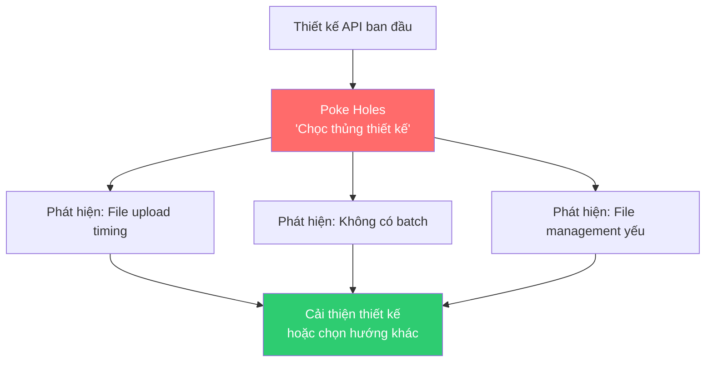
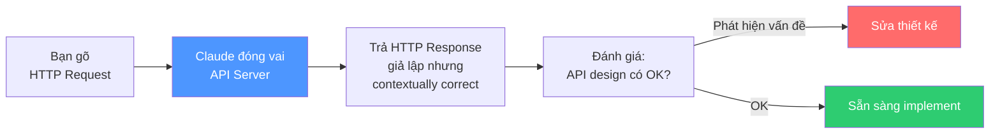
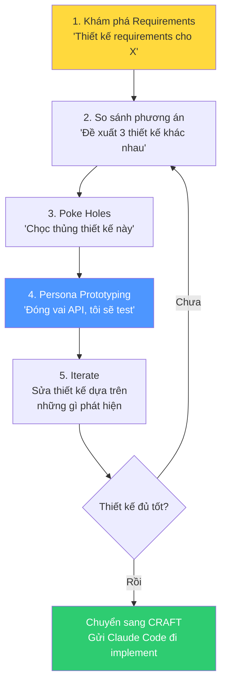

# Bài 6: Chat — Rapid Prototyping & Personas

## Nội dung chính

### Đi sâu hơn vào thiết kế: Interface Design

Tiếp tục cuộc hội thoại Chat, bây giờ chúng ta cần thiết kế interface cho hệ thống — cụ thể là API. Tác giả prompt:

> "Hãy thiết kế các API routes cốt lõi. Đề xuất 3 thiết kế khác nhau dựa trên các cấu trúc REST khác nhau. Tôi muốn 10 routes hoặc ít hơn."

Claude đưa ra 3 phương án:

| Phương án | Phong cách | Ví dụ routes |
|---|---|---|
| **Option 1** | Resource-oriented (Classic REST) | `/api/v1/jobs`, `/api/v1/jobs/:id`, `/api/v1/jobs/:id/logs` |
| **Option 2** | Action-oriented | `/execute`, `/status`, `/cancel`, `/results`, `/logs` |
| **Option 3** | Hybrid Task-focused | Kết hợp cả hai phong cách |

Từ đây bạn có thể tiếp tục drill down: so sánh, đánh giá cái nào "trung bình" nhất (average) — vì đôi khi average là tốt, giúp developer khác dễ hiểu nhanh.

### Kỹ thuật: Poke Holes — Tìm lỗ hổng thiết kế

Sau khi chọn một phương án, tác giả hỏi tiếp:

> "Với thiết kế API này, những use case nào sẽ khó hỗ trợ? Có friction gì? Hãy chọc thủng nó."

Claude phát hiện ngay các vấn đề:

| Vấn đề | Chi tiết | Gợi ý cải thiện |
|---|---|---|
| **File upload timing** | Phải tạo execution trước để có ID, rồi mới upload file → race conditions, logic phức tạp | Cho phép upload khi tạo, hoặc dùng khái niệm "workspace" |
| **Không hỗ trợ batch** | Không thể xử lý "5 file CSV cùng 1 script" | Thêm batch endpoint |
| **Quản lý file hạn chế** | Không list, delete, organize files được | Thêm file management routes |



### Kỹ thuật mạnh: Persona Pattern — Rapid Prototyping không cần code

Đôi khi bạn phải **thực sự dùng thử** API mới phát hiện được vấn đề. Nhưng chưa có code — làm sao?

Dùng **Persona Pattern**: bảo Claude **đóng vai** là API server.

> "Hãy đóng vai API này và giả vờ là implementation của server. Tôi sẽ gõ pseudo HTTP requests và bạn sẽ trả lời bằng HTTP response như server thật. Cho tôi xem vài sample requests."

#### Ví dụ tương tác:

**Request:**
```http
POST /api/v1/jobs
Content-Type: application/json

{
  "task": "Create a simple Python web server"
}
```

**Claude giả lập response:**
```http
HTTP/1.1 201 Created

{
  "id": "job_A7B3C9D1",
  "status": "running",
  "task": "Create a simple Python web server",
  "created_at": "2024-01-15T10:30:00Z"
}
```

**Tiếp tục test:**
```http
GET /api/v1/jobs/job_A7B3C9D1
```

Claude trả về status, kết quả, thậm chí **giả lập cả execution logs** — contextually correct vì nó nhớ task là "Create a Python web server".



### Tại sao Persona Pattern là "Super Mock"?

| Mock truyền thống | Persona Pattern |
|---|---|
| Phải viết code mock | Không cần code |
| Response cố định, hardcoded | Response **contextually correct** — hiểu ngữ cảnh |
| Tốn thời gian setup | Tức thì — chỉ cần 1 prompt |
| Chỉ mock được data | Mock được cả **behavior và logic** |

Bạn còn có thể biến nó thành role-playing game: "Ở mỗi bước, hãy mô tả cho tôi những gì sẽ hiển thị trên màn hình" — thậm chí dùng Claude Artifacts để thiết kế UI on-the-fly.

### Cảnh báo quan trọng

> Điều tệ nhất là triển khai Claude Code ở quy mô lớn, để nó xây dựng hàng đống code mà bạn chưa suy nghĩ kỹ. Chạy 20 phút, tạo ra khối lượng code khổng lồ, rồi nhận ra thiết kế có lỗ cơ bản, interface sai, requirements thiếu — và giờ rất khó sửa.

**Hãy dành thời gian khám phá thiết kế TRƯỚC KHI gửi Claude Code đi viết code.**

---

## Kiến thức bổ sung: Persona Pattern trong Prompt Engineering

### Persona Pattern là gì?

Persona Pattern là một kỹ thuật prompt engineering nơi bạn yêu cầu LLM **đóng vai** một thực thể cụ thể — có thể là:
- Một API server
- Một database
- Một user với profile cụ thể
- Một hệ thống legacy
- Một reviewer khó tính

### Các ứng dụng khác của Persona Pattern

| Persona | Ứng dụng |
|---|---|
| "Đóng vai user không biết kỹ thuật" | Test UX, tìm friction points |
| "Đóng vai security auditor" | Tìm lỗ hổng bảo mật trong thiết kế |
| "Đóng vai database" | Test query design, data model |
| "Đóng vai hệ thống legacy" | Thiết kế integration/migration |
| "Đóng vai đối thủ cạnh tranh" | Tìm điểm yếu sản phẩm |

### Quy trình Chat hoàn chỉnh



---

## Summary — Đúc rút kinh nghiệm

> **Hai kỹ thuật Chat cực mạnh: Poke Holes và Persona Pattern.** Poke Holes giúp bạn tìm lỗ hổng thiết kế trước khi viết code — hỏi Claude "chọc thủng" thiết kế của bạn. Persona Pattern là "super mock" — bảo Claude đóng vai API/system/user để bạn test thiết kế mà không cần viết một dòng code nào, với response contextually correct. Cả hai kỹ thuật đều nhằm một mục đích: đảm bảo thiết kế đúng TRƯỚC KHI gửi Claude Code đi xây dựng hàng nghìn dòng code. Thời gian đầu tư vào Chat luôn rẻ hơn nhiều so với refactor code sai thiết kế.
