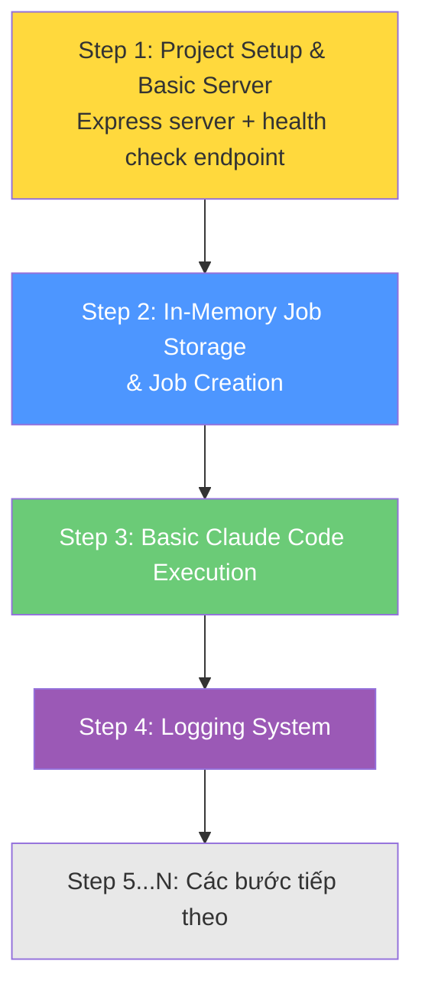
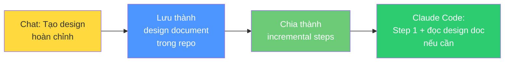
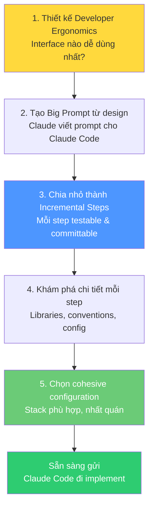

# Bài 7: Craft — Ràng buộc & Prompt cho Claude Code

## Nội dung chính

Chúng ta đã dành nhiều thời gian suy nghĩ về requirements, thiết kế, interfaces. Bây giờ phải bắt đầu **implement**. Đây là lúc bước vào giai đoạn **Craft**.

Craft là nghề thủ công của software developer — biết dùng thư viện nào, cấu trúc folder ra sao, cấu hình thế nào, deploy kiểu gì. Tất cả những chi tiết implementation quan trọng.

### Bước 1: Thiết kế Developer Ergonomics

Một điều bất ngờ: **developer ergonomics vẫn quan trọng** ngay cả khi AI viết code.

Tác giả prompt Claude:

> "Thiết kế 3 fluent client khác nhau bằng JavaScript để tương tác với API. Chỉ cho tôi xem cách sử dụng interface qua ví dụ."

Claude đưa ra 3 phong cách client khác nhau. Tại sao điều này quan trọng?

| Interface dễ dùng | Interface khó dùng |
|---|---|
| Claude Code viết code nhanh hơn | Claude Code mất nhiều thời gian hơn |
| Ít lỗi hơn | Nhiều lỗi hơn |
| Ít code hơn cho mỗi thao tác | Nhiều code hơn = nhiều chỗ sai hơn |

> Trực giác "interface này khó dùng" của bạn vẫn đúng khi áp dụng cho AI. Interface error-prone với con người cũng error-prone với Claude Code.

### Bước 2: Từ Design → Prompt cho Claude Code

Sau khi đã có thiết kế hoàn chỉnh qua Chat, làm sao chuyển thành prompt cho Claude Code?

Tác giả prompt Claude:

> "Tôi thích version 1 của tất cả các khía cạnh thiết kế. Bây giờ hãy viết một prompt hoàn chỉnh mà tôi có thể copy-paste vào Claude Code để implement."

Claude tạo ra prompt cực kỳ chi tiết bao gồm:
- Core requirements
- Data models
- Technical implementation details
- Directory structure
- JavaScript fluent client interface
- Implementation notes

→ Đây là **Big Prompt** — rất lớn, rất chi tiết.

### Bước 3: Chia nhỏ Big Prompt

Vấn đề: prompt quá lớn đôi khi khiến Claude Code bị sa lầy vào chi tiết. Giải pháp:

> "Đây là quá nhiều để làm một lần. Hãy chia kế hoạch này thành chuỗi các bước tăng dần. Mỗi bước phải kết thúc ở trạng thái có thể test được và commit. Bạn chọn số lượng bước."

Claude chia thành:

Mỗi step là một prompt riêng, có thể test và commit độc lập.

### Bước 4: Kỹ thuật Hybrid — Design Doc + Incremental Steps

Cách tiếp cận tối ưu:

1. Tạo design document đầy đủ từ cuộc Chat → lưu vào repo
2. Chia thành các step nhỏ
3. Với mỗi step, nói với Claude Code: "Đây là step 1. Nếu có câu hỏi về cách làm đúng hoặc có nhiều cách, hãy đọc design document để chọn cách phù hợp nhất."

→ Claude Code có cả **bức tranh lớn** (design doc) lẫn **nhiệm vụ cụ thể** (step).

### Bước 5: Khám phá chi tiết Implementation

Trước khi nhảy vào step 1, tác giả tiếp tục Chat để flesh out chi tiết:

> "Hãy nghĩ về các lựa chọn thư viện cho step này. Cũng nghĩ về chi tiết implementation, coding conventions, package structure, và những gì cần quyết định ngay."

Claude đưa ra các lựa chọn: web framework, language (JS vs TS), package structure...

Sau đó hỏi tiếp:

> "Đề xuất 3 cấu hình khác nhau và thảo luận pros/cons. Có chi tiết nào ảnh hưởng đến lựa chọn kiến trúc không?"

| Config | Stack | Pros | Cons |
|---|---|---|---|
| **1. Minimalist & Fast** | Express, JS, console.log, Jest | Nhanh nhất để implement | Thiếu type safety, logging cơ bản |
| **2. Production Ready** | Express, TypeScript, Winston, Jest | Robust, type-safe | Verbose, setup lâu hơn |
| **3. Modern & Light** | Fastify, JS, Pino, Vitest | Hiệu suất cao, modern | Ít phổ biến, ít tài liệu |

### Tổng kết quy trình Craft

---

## Kiến thức bổ sung: Chiến lược chia nhỏ Prompt

### Khi nào dùng 1 Big Prompt vs. Incremental Steps?

| 1 Big Prompt | Incremental Steps |
|---|---|
| Ứng dụng nhỏ, greenfield | Hệ thống phức tạp, nhiều component |
| Prototype nhanh | Production code cần chất lượng |
| Ít dependencies giữa các phần | Nhiều dependencies, cần test từng bước |
| Bạn OK với kết quả "đủ tốt" | Bạn cần kiểm soát chặt từng phần |

### Nguyên tắc chia step tốt

1. **Mỗi step phải testable** — chạy được, verify được
2. **Mỗi step phải committable** — có thể git commit mà code vẫn hoạt động
3. **Step sau xây trên step trước** — incremental, không phá vỡ cái đã có
4. **Mỗi step đủ nhỏ** để Claude Code không bị overwhelmed
5. **Mỗi step đủ lớn** để có ý nghĩa (không chia quá nhỏ thành micromanage)

### Meta-Prompting: Dùng Claude để viết prompt cho Claude Code

Đây là kỹ thuật **meta-prompting** — dùng AI để tạo prompt cho AI. Lợi ích:
- Prompt được tạo ra chi tiết hơn bạn tự viết
- Bao gồm context từ toàn bộ cuộc Chat trước đó
- Có cấu trúc rõ ràng, dễ cho Claude Code hiểu

---

## Summary — Đúc rút kinh nghiệm

> **Craft là nghệ thuật chuyển thiết kế thành prompt chất lượng cho Claude Code.** Quy trình: thiết kế developer ergonomics (interface dễ dùng = AI ít lỗi hơn) → dùng Claude tạo Big Prompt từ design → chia thành incremental steps (mỗi step testable & committable) → khám phá chi tiết libraries/config cho mỗi step → chọn cohesive configuration. Kỹ thuật hybrid mạnh nhất: lưu design doc vào repo + chia incremental steps, để Claude Code có cả bức tranh lớn lẫn nhiệm vụ cụ thể. Bạn không thiết kế từng dòng code — bạn craft các ràng buộc, phong cách, và hướng đi để Claude Code tạo ra đúng thứ bạn muốn.
