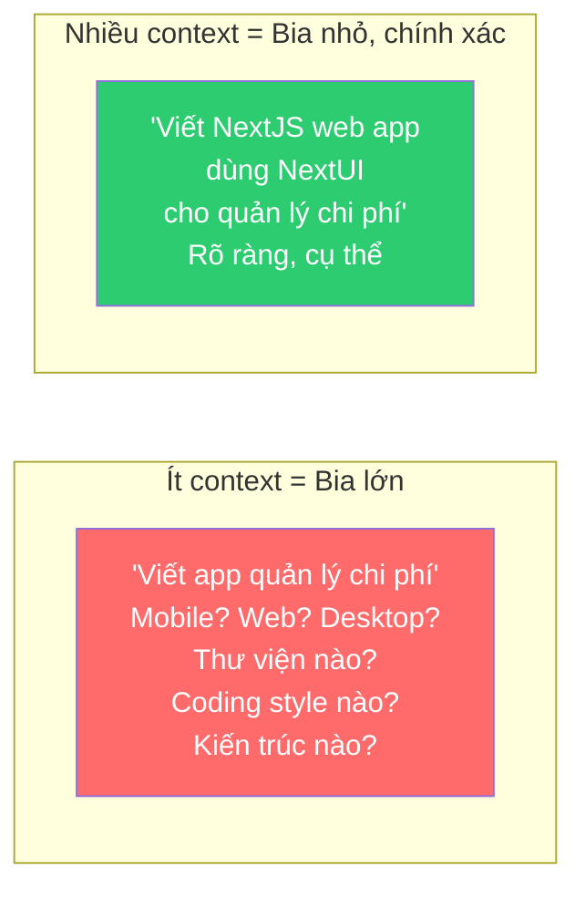
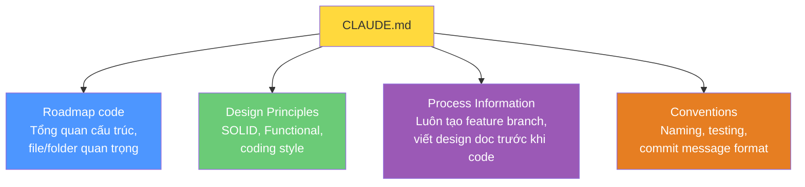
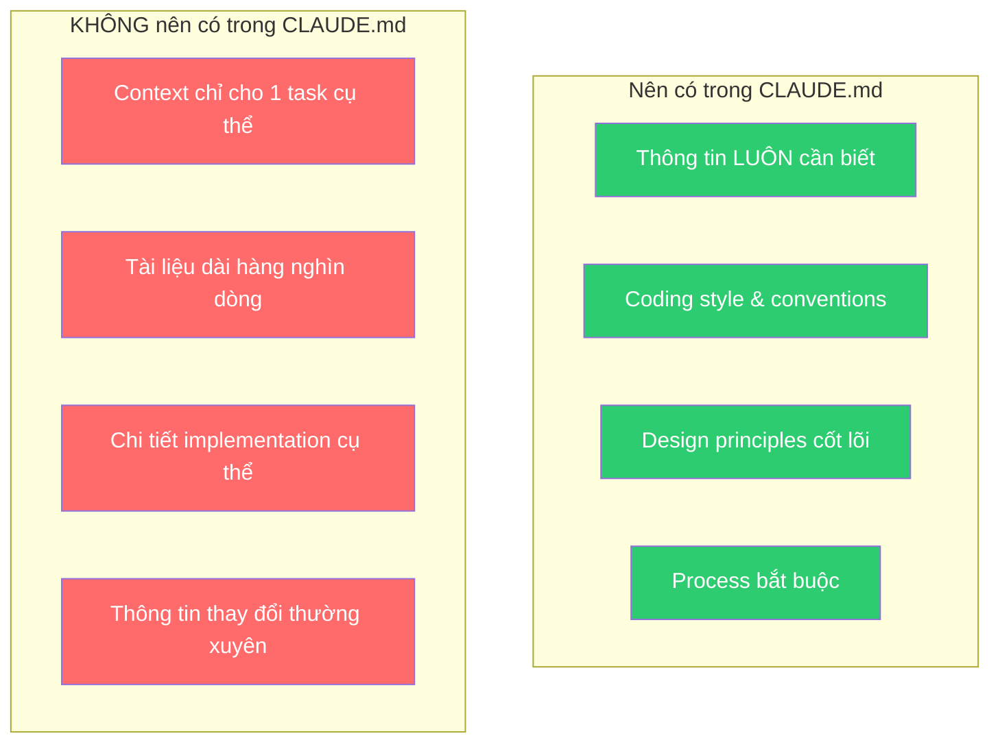

# Bài 1: Global Persistent Context — CLAUDE.md

## Nội dung chính

### Onboarding AI như onboarding team member mới

Hãy nghĩ về lượng **institutional knowledge** (kiến thức nội bộ) mà mỗi thành viên trong team phát triển của bạn có. Khi có thành viên mới, họ phải:
- Đọc codebase để hiểu
- Đọc README và tài liệu về coding style, conventions, rules
- Nói chuyện với developer khác
- Nhận feedback về công việc
- Thu thập lượng lớn context để biết cách viết phần mềm theo cách team bạn viết

**Claude Code cũng không khác gì.** Nó là thành viên mới mà bạn đang onboard, và bạn phải làm việc để "đào tạo" nó.

### Instructions + Context = Kết quả chính xác

Mỗi lần làm việc với Claude Code, bạn luôn cung cấp sự kết hợp của:
- **Instructions** — chỉ dẫn cần làm gì
- **Context** — thông tin cần biết để thực hiện đúng cách

> Context là thứ giúp thu hẹp mục tiêu cho instructions. Không có context, instructions có quá nhiều cách diễn giải.

### Ẩn dụ: Bắn cung vào bia



Nhưng cũng cần **cân bằng**: quá nhiều ràng buộc có thể khiến Claude Code bỏ lỡ giải pháp sáng tạo mà bạn chưa nghĩ tới.

### CLAUDE.md — Persistent Context cho mọi prompt

CLAUDE.md là file đặc biệt — **context cơ bản được cung cấp tự động mỗi khi bạn gõ prompt**. Nó giống như bộ nhớ tổ chức (institutional memory) cho Claude Code.

#### Khởi tạo CLAUDE.md

Trong Claude Code, gõ `/init` — Claude Code sẽ:
1. Khám phá codebase của bạn (như team member mới đọc code)
2. Thu thập thông tin
3. Tạo CLAUDE.md với tài liệu tóm tắt

→ Giống như giao cho nhân viên mới bài tập: "Đọc qua code và viết tài liệu."

#### Nên đưa gì vào CLAUDE.md?



### Ví dụ thực tế: Ép buộc SOLID Principles

Tác giả thêm vào CLAUDE.md:

```markdown
IMPORTANT!!!: DO THIS FOR ALL CODE.
Whenever you write code, it MUST follow the SOLID design principles.
Never write code that violates these principles.
If you do, you will be asked to refactor it.
```

Kết quả: Khi prompt "Write a 20-line Python function that can store data persistently", Claude Code ngay lập tức nói:

> "I'll create a Python function that stores data persistently **while following SOLID design principles**."

→ Nó đã tự động pick up context từ CLAUDE.md và áp dụng vào mọi task.

### CLAUDE.md KHÔNG phải nơi chứa mọi thứ



CLAUDE.md chứa **thông tin thiết yếu toàn cục** — không phải file 1000 trang. Context cho task cụ thể sẽ được cung cấp bằng cách khác (sẽ học ở các bài sau).

---

## Kiến thức bổ sung: Cấu trúc CLAUDE.md hiệu quảp

### Template CLAUDE.md đề xuất

```markdown
# Project Overview
[Mô tả ngắn gọn dự án]

# Tech Stack
- Framework: [...]
- Language: [...]
- Database: [...]

# Design Principles
- Follow SOLID principles
- [Các nguyên tắc khác]

# Coding Conventions
- [Naming conventions]
- [File structure rules]
- [Testing requirements]

# Process
- Always create feature branch before starting work
- Commit after each logical unit of work
- [Các bước process khác]

# Important Notes
- [Những điều đặc biệt cần biết]
```

### Prompt Engineering trong CLAUDE.md

Lưu ý cách tác giả viết instruction trong CLAUDE.md:
- `IMPORTANT!!!` — thu hút sự chú ý
- `MUST` (viết hoa) — nhấn mạnh bắt buộc
- `Never write code that violates` — negative constraint rõ ràng
- `If you do, you will be asked to refactor it` — hậu quả nếu vi phạm

Đây là kỹ thuật prompt engineering áp dụng cho persistent context.

---

## Summary — Đúc rút kinh nghiệm

> **CLAUDE.md là "bộ nhớ tổ chức" của Claude Code** — context được tự động cung cấp với mọi prompt. Hãy nghĩ về nó như tài liệu onboarding cho team member mới. Đưa vào đó: design principles, coding conventions, process bắt buộc, và tổng quan codebase. Giữ nó ngắn gọn và thiết yếu — đây không phải nơi chứa mọi thứ. Context = thu hẹp mục tiêu cho instructions, nhưng cần cân bằng: quá ít context → kết quả không đúng ý, quá nhiều ràng buộc → bỏ lỡ giải pháp sáng tạo. Dùng `/init` để khởi tạo, rồi chỉnh sửa thủ công để thêm institutional knowledge của team bạn.
