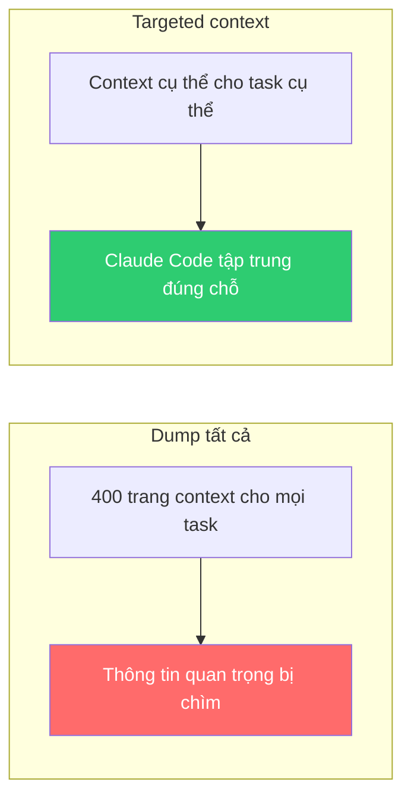
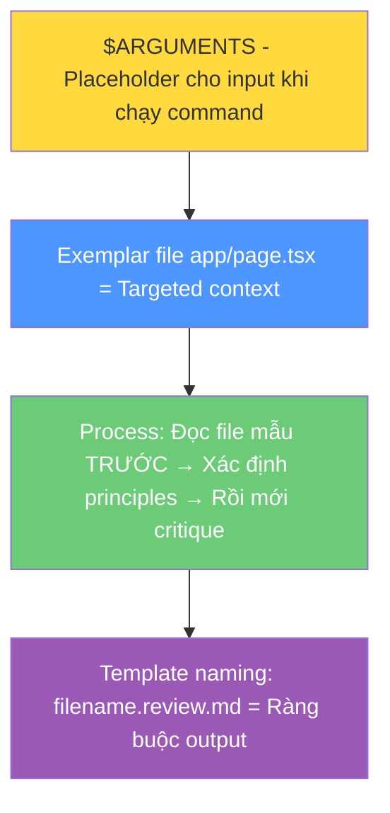
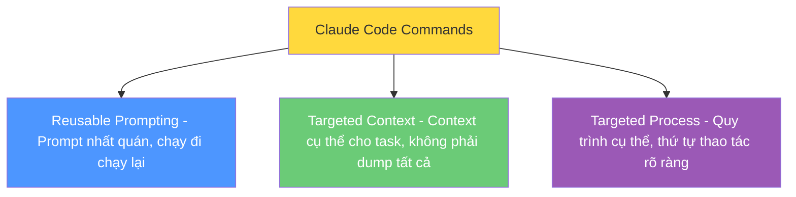
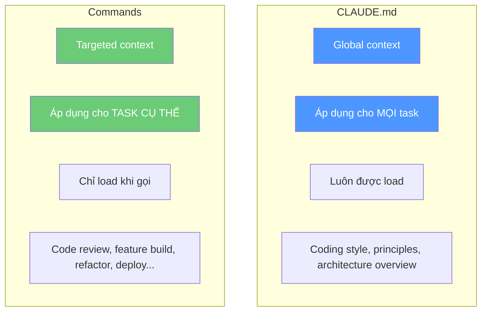

# Bài 3: Context & Process có mục tiêu, tái sử dụng — Claude Code Commands

## Nội dung chính

### Vấn đề: Quá nhiều context = Không hiệu quả

Hãy đặt mình vào vị trí developer mới. Team đã tỉ mỉ ghi lại mọi thông tin quan trọng — processes, coding style, cấu trúc code — trong một **tài liệu 400 trang**. Rồi giao cho bạn task đầu tiên kèm câu: "Đọc hết cái này rồi làm nhé."

Chuyện gì sẽ xảy ra?
- Lượng context **quá tải**
- Task đó có lẽ chỉ cần **nửa trang** thông tin thực sự liên quan
- Developer có thể mệt mỏi, bỏ lỡ thông tin quan trọng
- Thông tin không liên quan có thể **lấn át** thông tin quan trọng

Claude Code cũng vậy. Chúng ta cần cung cấp **đúng context, đúng lúc, cho đúng task**.



### Claude Code Commands là gì?

Commands là **file markdown** chứa prompt template có thể tái sử dụng. Chúng được lưu trong:

```
.claude/commands/          ← project-specific (version control được)
~/.claude/commands/        ← global (dùng cho mọi project)
```

Mỗi file markdown trở thành một prompt mà bạn có thể chọn nhanh từ menu Claude Code bằng cách gõ `/`.

### Ví dụ: Command Code Review

```markdown
Carefully perform a code review of $ARGUMENTS.

Examples of excellent code that you should try to match the
design/style/conventions of are: app/page.tsx

First, read a file that is closest to whatever code you are
evaluating and then identify its core design style, coding,
and other principles.

Then create a detailed critique of the code based on these
principles and output it to [filename].review.md for each
file that you review.
```

#### Phân tích prompt engineering trong command này:



| Kỹ thuật | Giải thích |
|---|---|
| `$ARGUMENTS` | Placeholder — được thay bằng input khi chạy command |
| Exemplar file | Targeted context — chỉ ra file mẫu để Claude hiểu style |
| Process ordering | "First read... then identify... then create" — thứ tự thao tác |
| `[filename].review.md` | Template naming — Claude tự điền tên file thông minh |

### Cách sử dụng

1. Trong Claude Code, gõ `/`
2. Chọn command `code-review`
3. Nhập arguments (ví dụ: `category-manager.tsx`)
4. Claude Code thực hiện theo prompt template

Claude Code sẽ:
1. Đọc `app/page.tsx` (file mẫu)
2. Xác định design principles từ file mẫu
3. Đọc `category-manager.tsx`
4. Tạo critique chi tiết
5. Lưu vào `category-manager.tsx.review.md`

### 3 Sức mạnh của Commands



### Commands vs. CLAUDE.md



### Ý tưởng mở rộng

- Tạo commands khác nhau cho **frontend vs backend** code review
- Có thể nhờ Claude Code **tự đề xuất** commands hữu ích cho project
- Commands nằm trong project → **version control** được → team members cùng dùng
- Cải thiện commands theo thời gian → **nâng cấp AI labor** liên tục

---

## Kiến thức bổ sung: Các loại Commands phổ biến

### Ý tưởng commands cho project

| Command | Mục đích |
|---|---|
| `/code-review` | Review code theo standards của team |
| `/new-feature` | Tạo feature mới theo đúng process |
| `/refactor` | Refactor code theo design principles |
| `/write-tests` | Viết tests cho module cụ thể |
| `/debug` | Debug issue theo quy trình có hệ thống |
| `/document` | Tạo documentation cho code |
| `/security-check` | Kiểm tra bảo mật |
| `/performance-review` | Đánh giá performance |

### Kỹ thuật Prompt Engineering trong Commands

1. **Exemplar Pattern**: Chỉ ra file mẫu để Claude học style
2. **Process Ordering**: Định nghĩa thứ tự bước rõ ràng (First... Then... Finally...)
3. **Template Naming**: Dùng `[placeholder]` để Claude tự điền thông minh
4. **$ARGUMENTS**: Cho phép input linh hoạt khi chạy command
5. **Output Constraints**: Chỉ định format và vị trí lưu output

---

## Summary — Đúc rút kinh nghiệm

> **Commands là cách cung cấp targeted context và process cho từng task cụ thể** — thay vì dump tất cả vào CLAUDE.md. Chúng là prompt templates tái sử dụng, lưu dưới dạng markdown trong `.claude/commands/`. Ba sức mạnh chính: reusable prompting (nhất quán), targeted context (đúng thông tin cho đúng task), và targeted process (quy trình cụ thể). Commands nằm trong project nên version control được, team cùng dùng, và cải thiện theo thời gian. Kết hợp CLAUDE.md (global context) + Commands (targeted context) = hệ thống context hoàn chỉnh cho Claude Code.
