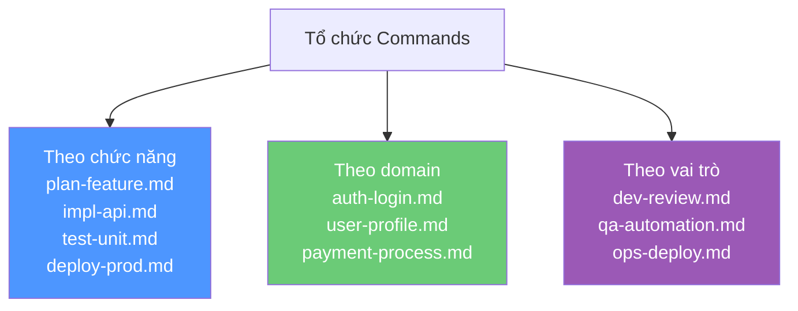
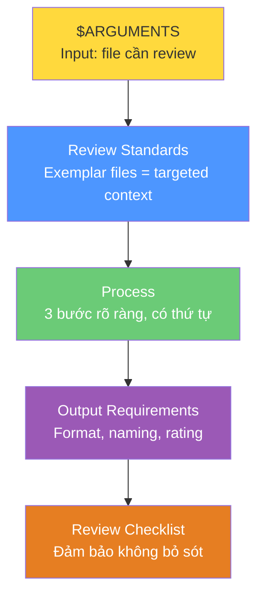
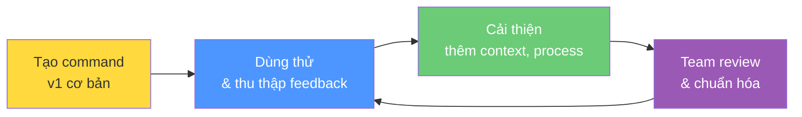
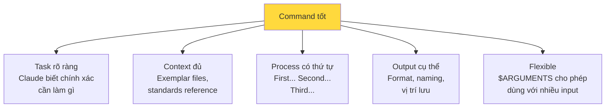

# Bài 4: Tạo Claude Commands

## Nội dung chính

### Claude Code Commands là gì?

Trong khi CLAUDE.md cung cấp global context cho mọi tương tác, **Commands cung cấp targeted context và process cho các task cụ thể, lặp lại**. Hãy nghĩ commands như bộ chỉ dẫn chuyên biệt — cho Claude Code chính xác những gì nó cần biết cho workflow cụ thể, không gây quá tải bằng thông tin không liên quan.

### Framework TARGETED cho thiết kế Command

| Chữ cái | Nguyên tắc | Ý nghĩa |
|---|---|---|
| **T** | Task-Specific Instructions | Chỉ dẫn cụ thể cho task |
| **A** | Arguments and Placeholders | Tham số và placeholder linh hoạt |
| **R** | Reusable Process Steps | Các bước process tái sử dụng |
| **G** | Guided Examples and References | Ví dụ và tham chiếu hướng dẫn |
| **E** | Explicit Output Requirements | Yêu cầu output rõ ràng |
| **T** | Template-Based Naming | Đặt tên dựa trên template |
| **E** | Error Handling and Edge Cases | Xử lý lỗi và edge cases |
| **D** | Documentation and Context | Tài liệu và context |

### 3 Nguyên tắc cốt lõi

1. **Right Context at the Right Time** — Giải quyết vấn đề "tài liệu 400 trang" bằng cách chỉ cung cấp context liên quan
2. **Reusable Consistency** — Đảm bảo cùng quy trình chất lượng cao mỗi lần thực hiện task
3. **Template-Driven Automation** — Dùng placeholders và templates để linh hoạt nhưng vẫn có cấu trúc

### Vị trí lưu trữ và tổ chức

```
.claude/commands/          ← Project-specific (version control)
~/.claude/commands/        ← Global (dùng cho mọi project)
```

#### Chiến lược tổ chức



---

## Ví dụ Commands thực tế

### Ví dụ 1: Code Review Command

File: `.claude/commands/code-review.md`

```markdown
# Code Review Command

Carefully perform a comprehensive code review of $ARGUMENTS.

## Review Standards
Examples of excellent code that you should match the
design/style/conventions of:
- `src/components/UserProfile/UserProfile.tsx` (React components)
- `src/utils/dataValidation.ts` (utility functions)
- `src/hooks/useUserData.ts` (custom hooks)

## Process
1. **First**: Read the example files above to understand our
   design patterns, naming conventions, and code style
2. **Second**: Analyze $ARGUMENTS against these standards
3. **Third**: Create detailed critique covering:
   - Code structure and organization
   - Adherence to established patterns
   - Performance considerations
   - Security implications
   - Maintainability concerns
   - Test coverage gaps

## Output Requirements
- Save review as `ai-code-reviews/{filename}.review.md`
- Include specific line references for issues
- Provide concrete suggestions for improvements
- Rate overall quality: Excellent/Good/Needs Improvement/Poor
- Estimate refactoring effort: Low/Medium/High

## Review Checklist
- Follows project naming conventions
- Proper error handling implemented
- No hardcoded values, secrets, or magic numbers
- Appropriate comments and documentation
- Follows existing design principles
- No obvious security vulnerabilities
- Performance optimizations considered
```

#### Phân tích cấu trúc:



### Ví dụ 2: API Test Command

File: `.claude/commands/api-test.md`

```markdown
# API Testing Command

Create comprehensive API tests for: $ARGUMENTS

## Testing Strategy
1. **Happy Path Testing**:
   - Valid request formats
   - Expected response structures
   - Proper HTTP status codes

2. **Error Handling Testing**:
   - Invalid request payloads
   - Authentication failures
   - Authorization edge cases
   - Rate limiting scenarios

3. **Edge Cases**:
   - Boundary value testing
   - Large payload handling
   - Concurrent request handling
   - Network timeout scenarios

## Test Structure Template
Create tests in `/tests/api/{endpoint-name}.test.ts`:

describe('{Endpoint Name} API', () => {
  describe('POST /{endpoint}', () => {
    it('should create {resource} with valid data', async () => {
      // Test implementation
    });
    it('should return 400 for invalid data', async () => {
      // Test implementation
    });
    it('should require authentication', async () => {
      // Test implementation
    });
  });
});
```

---

## Quản lý Commands hiệu quả

### Version Control

- Lưu project commands trong `.claude/commands/` để team cùng dùng
- Commit messages mô tả rõ khi update commands
- Review command changes như review code

### Command Evolution



- Thường xuyên review và update commands dựa trên feedback
- Archive commands cũ thay vì xóa
- Ghi lại thay đổi command trong project changelog

---

## Kiến thức bổ sung: Anatomy của một Command tốt

### Checklist thiết kế Command



### Mẹo nâng cao

1. **Exemplar Pattern**: Luôn chỉ ra file mẫu trong project — Claude sẽ học style từ đó
2. **Layered Commands**: Command đơn giản cho task thường ngày, command chi tiết cho task phức tạp
3. **Self-generating**: Nhờ Claude Code xem project và đề xuất commands hữu ích
4. **Composable**: Thiết kế commands có thể kết hợp — output của command này là input của command kia

---

## Summary — Đúc rút kinh nghiệm

> **Commands biến Claude Code từ trợ lý chung thành team member chuyên biệt** hiểu sâu workflow cụ thể của bạn. Dùng framework TARGETED để thiết kế: Task-specific instructions, Arguments, Reusable process, Guided examples, Explicit output, Template naming, Error handling, Documentation. Tổ chức commands theo chức năng/domain/vai trò, lưu trong `.claude/commands/` để version control và team sharing. Commands không phải viết một lần rồi quên — hãy cải thiện liên tục dựa trên feedback. Kết hợp CLAUDE.md (global) + Commands (targeted) = hệ thống context hoàn chỉnh, đúng thông tin đúng lúc.
