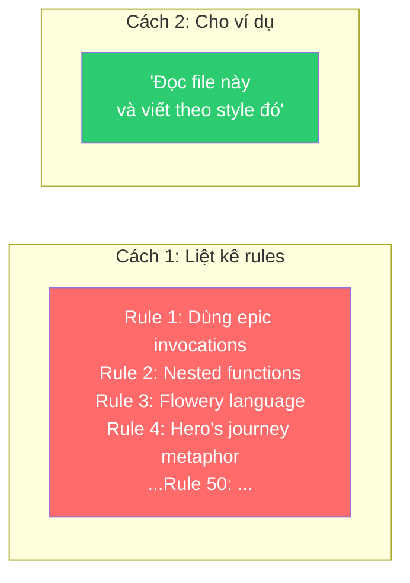
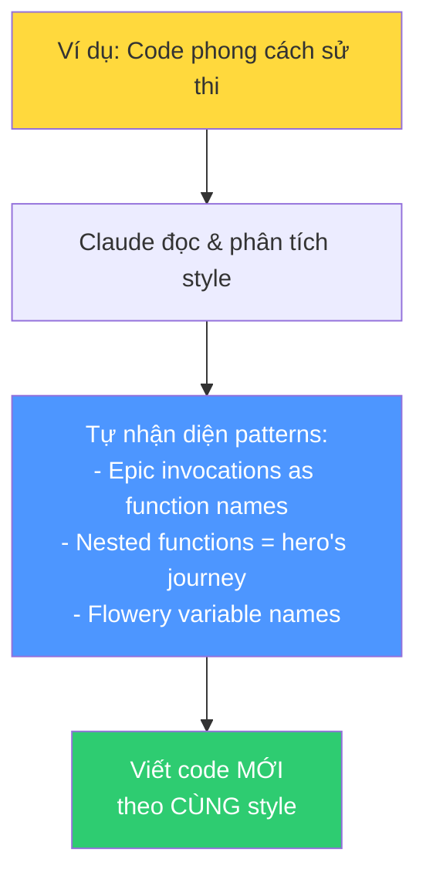
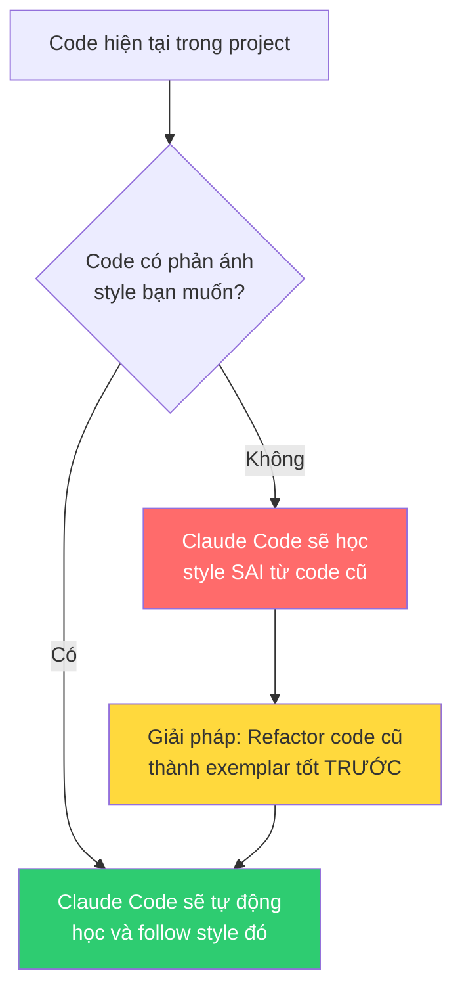

# Bài 5: In-Context Learning — Dạy bằng ví dụ

## Nội dung chính

### Điều đầu tiên khi vào codebase mới

Khi được thả vào codebase mới, tôi thường làm gì?

1. **Đọc documentation** — hiểu cấu trúc project
2. **Đọc code** — và đây mới là phần thực sự giá trị

Khi đọc code, tôi học được rất nhiều thứ **không có trong tài liệu**: style viết code, quyết định kiến trúc, cách thiết kế, cách đặt tên, cách tư duy... Tất cả chứa đựng trong chính code.

> Với con người, một trong những cách dạy mạnh mẽ nhất là **dạy bằng ví dụ**. Claude Code cũng vậy.

### Ví dụ thường mạnh hơn danh sách instructions

Ví dụ là cách truyền đạt **information-dense** — chứa đựng rất nhiều thông tin trong một lượng nhỏ context.

### Thí nghiệm: Học style từ ví dụ

#### Bước 1: Viết thơ theo style

Tác giả đưa cho Claude một đoạn trích từ The Odyssey và nói: "Viết về Nashville, Tennessee theo style này."

Kết quả: Claude viết về Nashville theo phong cách sử thi Homer — "Sing to me, O Muse, of the melodious city that rises from the rolling hills beside the winding Cumberland River..."

Tác giả **không hề mô tả** style đó là gì. Chỉ cho ví dụ, Claude tự học.

#### Bước 2: Chuyển style sang Python code

> "Viết Python code dày đặc, lấy cảm hứng từ bài thơ này."

Claude tạo ra Python code với phong cách sử thi: `def invoke_O_Muse_of_that_ingenious_code_which_traveled_far_and_wide()`

#### Bước 3: Conversation mới — học từ code

Trong conversation hoàn toàn mới (không có context trước), tác giả đưa file Python "phong cách sử thi" đó và nói:

> "Đọc và hiểu style, architecture, coding conventions của code này. Bây giờ viết thuật toán sorting theo cùng style."

Claude nhận ra ngay: "Nhìn vào phong cách Homeric epic dưới dạng Python, tôi thấy: epic invocations làm tên hàm, nested functions đại diện cho hành trình anh hùng..."

Rồi viết sorting algorithm: `invoke_O_Muse_of_that_disordered_array_which_traveled_through_memory_seeking_the_blessed()`

### Ứng dụng thực tế trong Claude Code

Đây không chỉ là thí nghiệm vui — đây là cách Claude Code hoạt động hàng ngày:

1. **Claude Code đọc code hiện có** trong project → tự động học style
2. **Bạn có thể chỉ định exemplar files** trong commands: "Đọc file này và học từ nó"
3. **Code của bạn trở thành ví dụ** mà Claude Code sẽ bị ảnh hưởng bởi

### Hệ quả quan trọng

> Nếu code hiện tại không phản ánh style bạn muốn → hãy refactor nó trước. Vì code đó sẽ trở thành "ví dụ" mà Claude Code học theo.

### Hai cách dạy Claude Code

| Declarative (Khai báo) | By Example (Bằng ví dụ) |
|---|---|
| "Follow SOLID principles" | "Đọc file X và viết theo style đó" |
| Liệt kê rules cụ thể | Cho xem code mẫu |
| Tốt cho rules rõ ràng, ngắn gọn | Tốt cho style, conventions, patterns phức tạp |
| Có thể bỏ sót chi tiết | Chứa đựng thông tin ngầm phong phú |

Cách tốt nhất: **kết hợp cả hai** — declarative rules trong CLAUDE.md + exemplar files trong commands.

---

## Kiến thức bổ sung: In-Context Learning trong AI

### In-Context Learning (ICL) là gì?

ICL là khả năng của LLM **học từ ví dụ được cung cấp trong prompt** mà không cần fine-tuning. Đây là một trong những khả năng mạnh nhất của các model lớn.

Các dạng ICL:
- **Zero-shot**: Không có ví dụ, chỉ có instruction
- **One-shot**: 1 ví dụ
- **Few-shot**: 2-5 ví dụ
- **Many-shot**: Nhiều ví dụ

Trong context Claude Code:
- CLAUDE.md = zero-shot instructions
- Command với 1 exemplar file = one-shot learning
- Command với nhiều exemplar files = few-shot learning

### Mẹo chọn Exemplar Files

1. **Chọn file đại diện nhất** cho style bạn muốn
2. **Đa dạng ví dụ**: component file, utility file, hook file — mỗi loại 1 exemplar
3. **Ví dụ phải sạch**: code mẫu phải thực sự tốt, vì Claude sẽ copy cả lỗi
4. **Cập nhật exemplars** khi style team thay đổi

---

## Summary — Đúc rút kinh nghiệm

> **Ví dụ là cách dạy information-dense nhất cho Claude Code.** Thay vì liệt kê hàng trăm rules, hãy chỉ ra exemplar files — Claude sẽ tự học style, conventions, patterns từ đó. Code hiện tại trong project tự động trở thành "ví dụ" mà Claude Code bị ảnh hưởng — nên hãy đảm bảo code đó phản ánh style bạn muốn, hoặc refactor trước. Kết hợp declarative rules (CLAUDE.md) + exemplar files (Commands) = hệ thống dạy hoàn chỉnh. In-context learning là một trong những khả năng mạnh nhất của LLM — hãy tận dụng nó.
