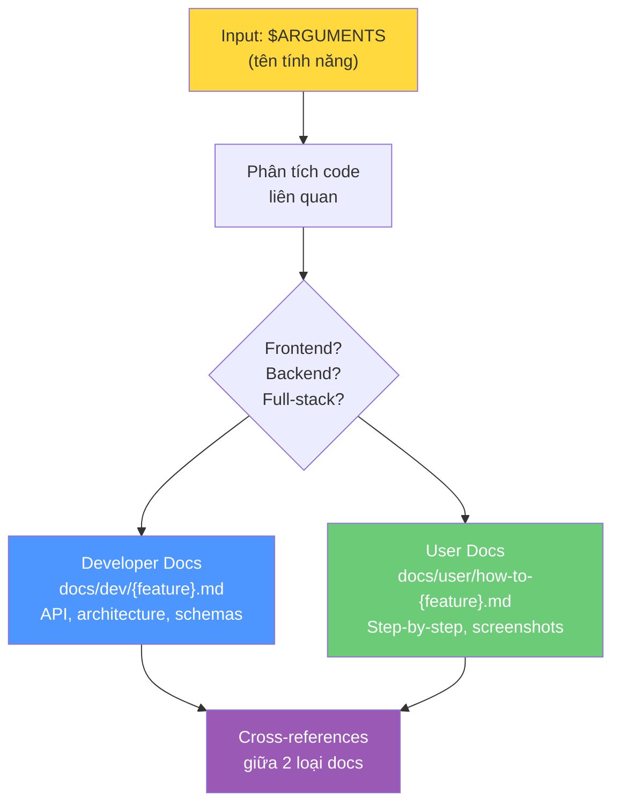

# Bài 6: Bài tập — Xây dựng Documentation Generator

## Mục tiêu

Xây dựng một Claude Code command tự động tạo cả **tài liệu kỹ thuật** cho developer và **hướng dẫn thân thiện** cho end user khi bạn thêm tính năng mới.

## Thiết lập

Tạo file command mới: `.claude/commands/document-feature.md`

## Yêu cầu

Command cần:
1. Nhận **tên tính năng** làm input (`$ARGUMENTS`)
2. Phân tích các file code liên quan
3. Tạo **2 file documentation riêng biệt** trong thư mục phù hợp
4. Tuân theo patterns documentation hiện có của project
5. Bao gồm placeholders cho screenshots trong user docs
6. Thêm cross-references giữa 2 loại tài liệu

## Output mong đợi

Với input `password-reset`, command sẽ tạo:

```
docs/dev/password-reset-implementation.md    ← Technical specs, API, implementation notes
docs/user/how-to-reset-password.md           ← Hướng dẫn step-by-step cho user
```

## Gợi ý cấu trúc Command

```markdown
# Document Feature Command

Generate comprehensive documentation for: $ARGUMENTS

## Analysis Phase
1. Find all code files related to $ARGUMENTS
2. Identify if feature is frontend/backend/full-stack
3. Read existing documentation patterns in /docs

## Developer Documentation
Create `docs/dev/{feature-name}-implementation.md`:
- Architecture overview
- API endpoints and contracts
- Data models and schemas
- Key implementation decisions
- Dependencies and integrations
- Testing approach

## User Documentation
Create `docs/user/how-to-{feature-name}.md`:
- Feature overview (non-technical language)
- Step-by-step instructions
- [Screenshot: {step-description}] placeholders
- Common issues and troubleshooting
- Related features (cross-reference)

## Cross-References
- Link dev docs → user docs and vice versa
- Link to related existing documentation
```

## Bonus

- Tự detect frontend/backend/full-stack và điều chỉnh documentation
- Tự động capture và chèn screenshots trong user docs
- Auto-link đến documentation liên quan đã có



---

# Bài 7: Đóng góp — Xây dựng kho tài nguyên Commands & CLAUDE.md

## Nội dung

Sức mạnh của Claude Code **nhân lên** khi chúng ta chia sẻ các patterns, commands, và processes đã được chứng minh hiệu quả.

Khi bạn phát triển được workflow thực sự cải thiện năng suất, hãy cân nhắc đóng góp lại cho cộng đồng:
- Claude Code commands hiệu quả nhất
- CLAUDE.md templates được thiết kế tốt
- Process documentation sáng tạo
- Giải pháp cho các thách thức phát triển phổ biến

> Mỗi command được chia sẻ trở thành viên gạch xây dựng cho bước đột phá của developer tiếp theo.

Repository cộng đồng: [github.com/juleswhite/claude-code](https://github.com/juleswhite/claude-code)

---

## Summary — Đúc rút kinh nghiệm Module 04

> **Module 04 xây dựng hệ thống context hoàn chỉnh cho Claude Code** qua 3 tầng: (1) CLAUDE.md — global persistent context, institutional knowledge cho mọi prompt; (2) Commands — targeted context & process cho task cụ thể, tái sử dụng được; (3) In-Context Learning — dạy bằng exemplar files, mạnh hơn liệt kê rules. Kết hợp cả 3 tầng = Claude Code hiểu project như team member lâu năm. Và đừng quên: code hiện tại trong project tự động trở thành "ví dụ" — hãy đảm bảo nó phản ánh style bạn muốn.
