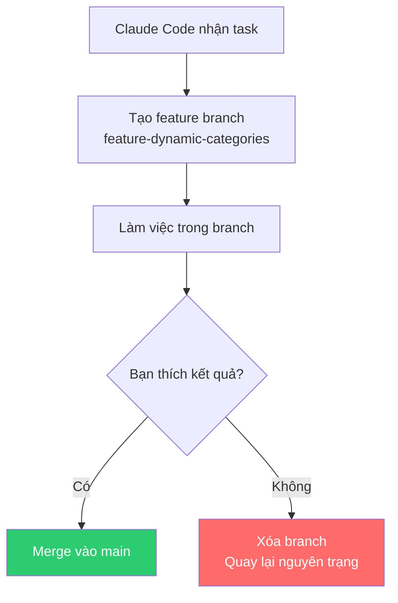
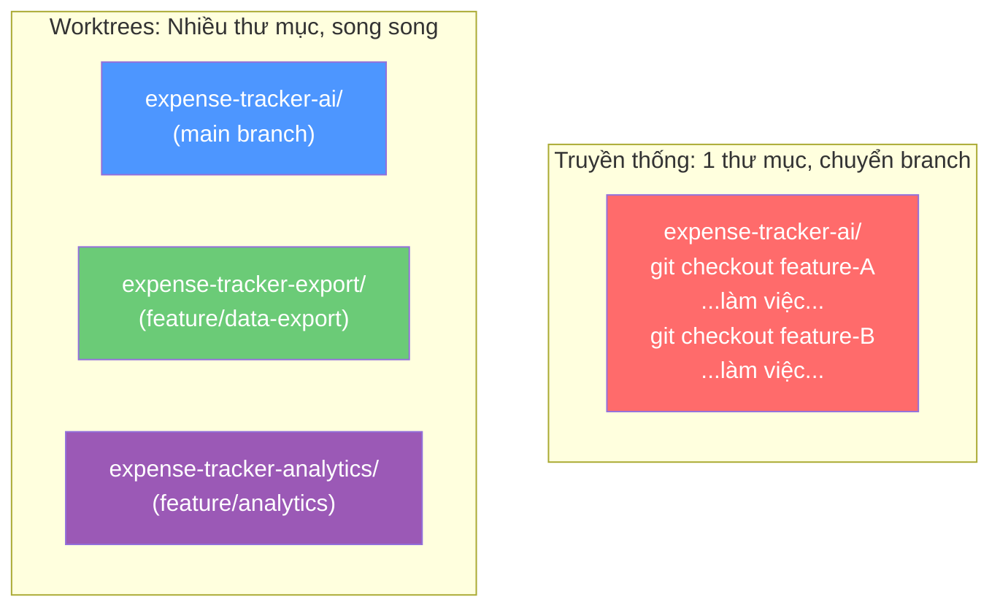

# Bài 1: Claude Code, Version Control & Git Branches

## Nội dung chính

Mọi lập trình viên đều mắc lỗi. Chúng ta có nhiều hệ thống để xử lý — tests, code review — nhưng một trong những công cụ mạnh nhất là **version control**. Nó cho phép tìm ra lỗi ban đầu, quay ngược thời gian, undo, và cô lập thay đổi.

Khi dùng AI labor với Claude Code, version control **càng quan trọng hơn bao giờ hết**.

### Điều đầu tiên trong CLAUDE.md: Version Control

> Có lẽ điều quan trọng nhất tôi làm khi thiết lập CLAUDE.md mới là chỉ dẫn Claude Code cách xử lý version control.

```markdown
# Trong CLAUDE.md:
Before you make any change, create and checkout a feature branch
named feature-[brief-description].
Make and then commit your changes in this branch.
```

Đây là global context — điều bạn **luôn luôn** muốn Claude Code làm, bất kể task nào.

### Tại sao luôn dùng branches?



Lợi ích:
- **Cô lập thay đổi** — dễ xem tất cả changes trong 1 branch
- **Dễ rollback** — không thích? Xóa branch, quay lại ngay
- **Merge & cherry-pick** — kết hợp features từ nhiều branches
- **Commit messages tuyệt vời** — Claude Code viết commit messages chi tiết hơn hầu hết developer

### Template naming cho branches

Dùng template trong CLAUDE.md để đảm bảo nhất quán:

```markdown
feature-[brief-description]     ← Claude Code tạo
ai-feature-[description]        ← Phân biệt AI vs human branches
```

> Mẹo: Đặt prefix `ai-` để phân biệt branch do AI tạo và branch do người tạo.

### Commit messages

Claude Code viết commit messages **cực kỳ chi tiết** — tốt hơn hầu hết developer (vì chúng ta thường lười). Bạn có thể:
- Chỉ dẫn format commit message trong CLAUDE.md
- Bảo nó đọc git log để học style commit messages hiện có

---

## Summary — Đúc rút kinh nghiệm

> **Version control là nền tảng bắt buộc khi dùng AI labor.** Điều đầu tiên trong CLAUDE.md: luôn tạo feature branch trước khi làm việc. Branches cho phép cô lập, rollback dễ dàng, merge/cherry-pick linh hoạt. Dùng template naming để nhất quán. Không có version control strategy = nhanh chóng rơi vào hỗn loạn khi scale AI labor.

---

# Bài 2: Cho phép Claude Code làm việc song song với Git Worktrees

## Nội dung chính

### Git Worktrees là gì?

Git worktrees cho phép checkout **nhiều branches từ cùng repository vào các thư mục riêng biệt**. Mỗi worktree có working directory riêng, cô lập hoàn toàn, nhưng chia sẻ cùng Git history.



### Thiết lập phát triển song song

Prompt cho Claude Code:

```
I want to develop two features in parallel using Git worktrees:
1. Data export system (CSV, PDF, JSON exports)
2. Analytics dashboard (charts, insights, trends)

Please help me set up the worktree environment:
1. Create a worktree for export at ../expense-tracker-export
   with branch feature/data-export
2. Create a worktree for analytics at ../expense-tracker-analytics
   with branch feature/analytics-dashboard
3. List all worktrees to confirm
```

Cấu trúc thư mục sau khi setup:

```
/expense-tracker-ai/         # Main worktree (main branch)
/expense-tracker-export/     # Export worktree (feature/data-export)
/expense-tracker-analytics/  # Analytics worktree (feature/analytics)
```

### Chạy Claude Code song song

Mở 2 terminal riêng biệt:

```bash
# Terminal 1 - Export Feature
cd ../expense-tracker-export && claude

# Terminal 2 - Analytics Feature
cd ../expense-tracker-analytics && claude
```

Hai Claude Code instances làm việc **hoàn toàn cô lập** — thay đổi ở worktree này không ảnh hưởng worktree kia.

### Merge features về main

```
I have two features developed in parallel worktrees:
- feature/data-export
- feature/analytics-dashboard

Please:
1. Create integration branch "integration/export-analytics"
2. Merge feature/data-export into integration branch
3. Merge feature/analytics-dashboard into integration branch
4. Resolve any merge conflicts
5. Test that both features work together
6. Run all tests
```

### Reusable Commands

**`.claude/commands/parallel-work.md`** — Setup worktrees:

```markdown
I want to develop features in parallel using Git worktrees: $ARGUMENTS

For each feature:
1. Create worktree at ../expense-tracker-[feature-name]
   with branch feature/[feature-name]
2. Set up development environment
3. List all worktrees to confirm
```

**`.claude/commands/integrate-parallel-work.md`** — Merge:

```markdown
I have features in parallel worktrees to integrate: $ARGUMENTS

1. Create integration branch "integration/parallel-features"
2. For each feature, merge feature/[feature-name]
3. Resolve merge conflicts
4. Test all features work together
5. Run all tests
6. Merge to main and clean up
```

Sử dụng: `/integrate-parallel-work budget-tracking notifications user-settings`

---

## Summary — Đúc rút kinh nghiệm

> **Git worktrees + Claude Code = phát triển song song thực sự.** Mỗi worktree là môi trường cô lập hoàn toàn — chạy Claude Code instance riêng trong mỗi worktree để phát triển nhiều features đồng thời. Tạo reusable commands cho setup worktrees và integration để workflow nhất quán. Luôn merge qua integration branch trước khi vào main.
