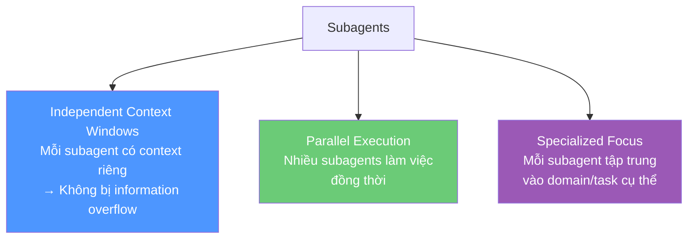
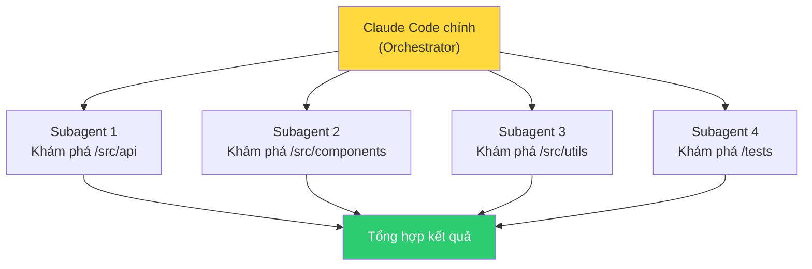
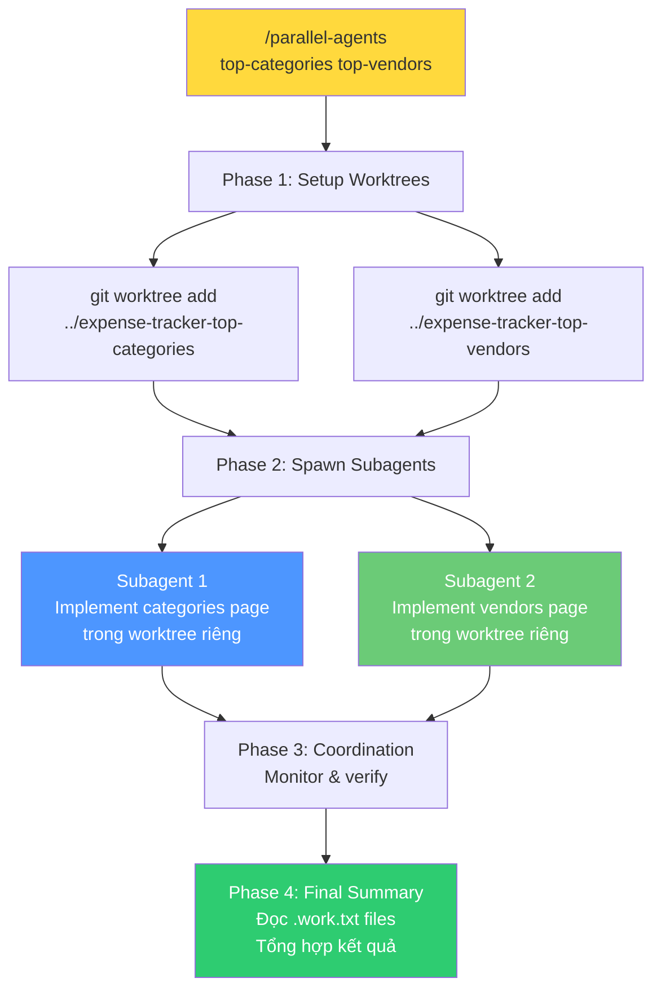
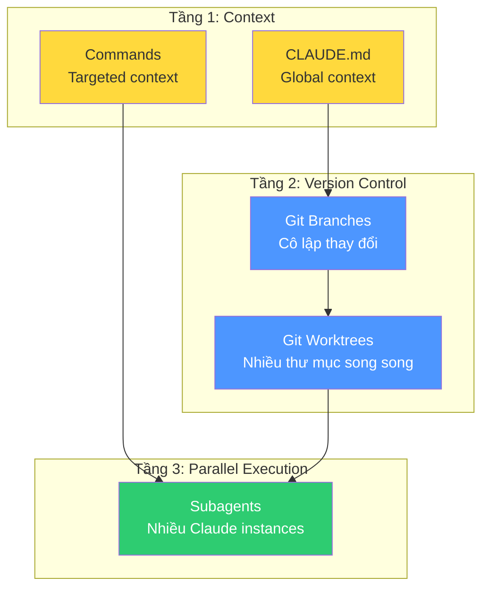

# Bài 3: Claude Subagents & Tasks

## Nội dung chính

### Subagents là gì?

Subagents là một trong những tính năng mạnh nhất của Claude Code cho các dự án phức tạp và codebase lớn. Chúng cho phép chạy **nhiều Claude instances chuyên biệt song song**, mỗi cái có context và focus riêng.

Khi subagent chạy, bạn sẽ thấy output hiển thị: `Task(Performing task X)`.

### Lợi ích chính



### Ví dụ: 2 Subagents phân tích Frontend & Backend

```
Can you run two subagents?
One should analyze improvements to the back-end.
One should analyze improvements to the front end.
Please run them in parallel.
```

Claude Code tạo 2 tasks song song:
- Subagent 1: Tập trung phân tích backend, đề xuất cải thiện
- Subagent 2: Tập trung phân tích frontend, đề xuất cải thiện

Mỗi subagent có **context window riêng** → có thể đi sâu vào files liên quan mà không bị overwhelm.

### Ví dụ: 4 Subagents khám phá codebase lớn

```
Explore the codebase using 4 tasks in parallel.
Each agent should explore different directories.
```

Đặc biệt hữu ích cho:
- **Codebase lớn**: Hiểu nhiều components nhanh chóng
- **Đánh giá dự án ban đầu**: Có cái nhìn toàn diện mà không overwhelm 1 context window
- **Tách domain**: Mỗi subagent focus vào layer kiến trúc khác nhau



---

# Bài 4: Phát triển Feature song song với Subagents, Tasks & Git Worktrees

## Nội dung chính

### Kết hợp tất cả: Subagents + Worktrees

Bài này kết hợp subagents với git worktrees để Claude Code **tự động setup worktrees, spawn subagents, và phát triển nhiều features song song** — tất cả từ một session duy nhất.

### Cấu trúc thư mục quan trọng

```
/parent-directory/                    # ← Chạy Claude Code TỪ ĐÂY
├── expense-tracker-ai/               # Main project
```

Phải chạy Claude Code từ **parent directory**, không phải từ trong project.

### Command: parallel-agents.md

File: `.claude/commands/parallel-agents.md`

```markdown
I want to develop features in parallel using Git worktrees
and subagents: $ARGUMENTS

You are in the parent folder of the main repo.

PHASE 1 - SETUP WORKTREES:
For each feature:
1. Create worktree at ../expense-tracker-[feature-name]
   with branch feature/[feature-name]
2. Set up development environment
3. List all worktrees created

PHASE 2 - SPAWN SUBAGENTS:
For each feature, run a subagent in parallel:
- Work in expense-tracker-[feature-name] worktree
- Implement the feature with full functionality
- Include testing and error handling
- Write summary in [feature-name].work.txt

PHASE 3 - COORDINATION:
- Monitor all subagents
- Ensure each completes their implementation
- Verify each creates their work summary

PHASE 4 - FINAL SUMMARY:
1. Read all .work.txt files
2. Comprehensive summary of accomplishments
3. List all features and status
4. Next steps for integration
```

### Workflow hoàn chỉnh



### Kết quả thực tế

Khi chạy `/parallel-agents Implement a simple top expense categories page and a simple top vendors page`, Claude Code:

1. Tạo 2 worktrees
2. Cài dependencies trong mỗi worktree
3. Spawn 2 subagents song song
4. Mỗi subagent implement feature hoàn chỉnh:
   - **Categories page**: sorted by spending, bar charts, color-coded, emojis, statistics
   - **Vendors page**: top 10 vendors, spending amounts, transaction counts, responsive design
5. Tổng hợp kết quả và đề xuất next steps cho integration

Tất cả **tự động**, từ một command duy nhất.

### Sơ đồ tổng hợp: Hệ thống Scale hoàn chỉnh



---

## Kiến thức bổ sung: So sánh các cách scale AI Labor

| Phương pháp | Cách hoạt động | Khi nào dùng |
|---|---|---|
| **Big Prompts** | 1 Claude Code, 1 task lớn | Feature đơn lẻ, greenfield |
| **Best of N** | 1 Claude Code, N branches | So sánh nhiều phương án |
| **Manual Worktrees** | N terminals, N Claude Code instances | Phát triển song song, kiểm soát thủ công |
| **Subagents + Worktrees** | 1 session orchestrate N subagents | Phát triển song song tự động, scale tối đa |

---

## Summary — Đúc rút kinh nghiệm Module 05

> **Module 05 hoàn thiện khả năng scale AI labor.** Git branches cô lập thay đổi và cho phép rollback dễ dàng — luôn đặt trong CLAUDE.md. Git worktrees cho phép nhiều Claude Code instances làm việc song song trên các thư mục riêng biệt. Subagents cho phép orchestrate nhiều tasks từ một session. Kết hợp cả ba: subagents tự động tạo worktrees và phát triển features song song — đây là đỉnh cao của việc scale AI labor, biến bạn thành "CEO" điều phối đội ngũ phát triển AI.
