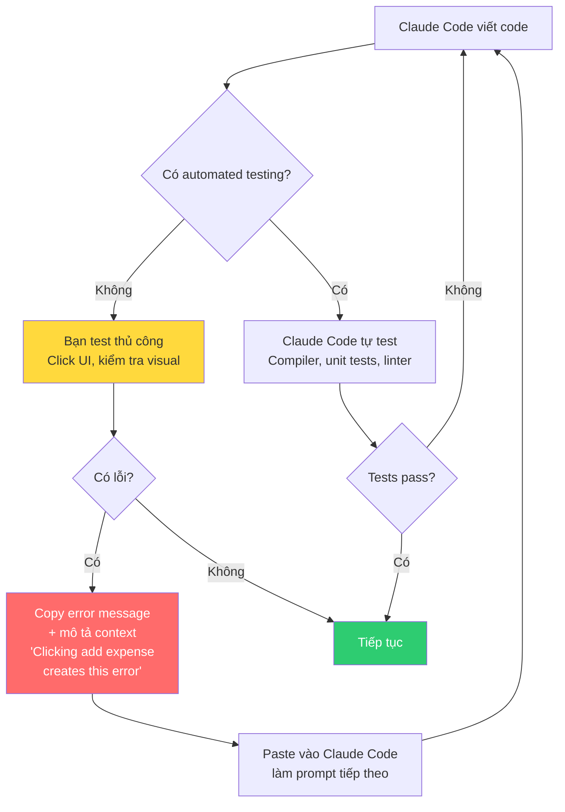
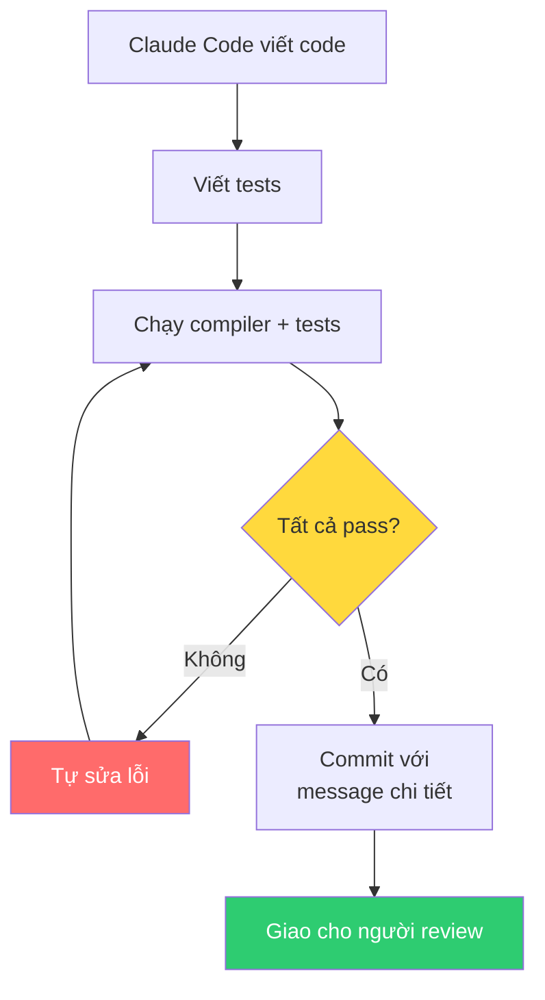

# Bài 1-2: Làm tay, mắt, tai cho Claude Code & Đảm bảo Claude Code tự kiểm tra

## Bài 1: Làm tay, mắt, tai cho Claude Code

### Nội dung chính

Tôi nghĩ về kỹ thuật phần mềm như **quá trình tìm kiếm**: thay đổi code → kiểm tra xem thay đổi có hoạt động không (compile, test, UI) → nếu OK thì giữ, nếu không thì iterate.

Chìa khóa: phải có **feedback** về kết quả.

Claude Code có công cụ tốt để tự lấy feedback — chạy compiler, chạy tests. Nhưng có những thứ nó **không thể tự làm**:
- Tương tác với UI (nếu chưa có automated UI testing)
- Đánh giá thẩm mỹ giao diện
- Phát hiện lỗi chỉ xuất hiện khi dùng thực tế

Trong những trường hợp đó, bạn phải là **tay, mắt, tai** của Claude Code.

### Quy trình feedback



### Cách cung cấp feedback đúng

Khi phát hiện lỗi ngoài vòng lặp của Claude Code:

**❌ Sai**: "Claude Code mắc lỗi ngớ ngẩn, AI tệ quá"

**✅ Đúng**: Cung cấp context đầy đủ:
- **Error message** — copy-paste hoặc screenshot
- **Khi nào lỗi xảy ra** — "Clicking add expense creates this error"
- **Bạn đang làm gì** — mô tả hành động dẫn đến lỗi

### Mục tiêu: Giảm thiểu vai trò "tay, mắt, tai"

> Càng nhiều thứ bạn phải làm thay Claude Code → bạn càng trở thành bottleneck → càng khó scale AI labor.

Khi thấy pattern này xuất hiện, hãy nghĩ: **Làm sao tự động hóa?**
- UI testing → Playwright, Cypress
- Visual testing → Screenshot comparison tools
- Integration testing → Automated API tests
- Remote browser control → Puppeteer

---

## Bài 2: Đảm bảo Claude Code tự kiểm tra công việc

### Nội dung chính

Chúng ta có thể làm tay, mắt, tai cho Claude Code — nhưng **không nên**. Giống như developer lười không chạy linter trước khi commit, Claude Code cũng có thể "quên" nếu không được chỉ dẫn.

> Claude Code không mệt mỏi — nhưng nếu không được chỉ dẫn tự kiểm tra, nó có thể không làm.

### Giải pháp: Đặt quy trình kiểm tra trong CLAUDE.md

```markdown
# Trong CLAUDE.md:
1. Before making any changes, create a feature branch
2. Write comprehensive tests for all new functionality
3. Compile code and run ALL tests before committing
4. All tests must pass before you commit
5. Write detailed commit messages
```

### Vòng lặp feedback tự động



Nếu không có quy trình này:
- Claude Code viết code → nghĩ xong → commit
- Bạn chạy app → lỗi compilation → phải quay lại báo Claude Code
- **Lãng phí thời gian con người** — thời gian quý giá nhất

Với quy trình này:
- Claude Code viết code → viết tests → chạy tests → tự sửa nếu lỗi → chỉ commit khi pass
- Bạn nhận code **đã hoạt động** → review chất lượng cao hơn

> Đoạn context đơn giản này trong CLAUDE.md sẽ **tiết kiệm cho bạn rất nhiều thời gian**.

---

## Summary — Đúc rút kinh nghiệm

> **Hai nguyên tắc feedback cho Claude Code**: (1) Khi Claude Code không thể tự test (UI, visual), hãy là tay-mắt-tai của nó — cung cấp error messages + context đầy đủ, nhưng luôn tìm cách tự động hóa để giảm bottleneck. (2) Đặt quy trình tự kiểm tra trong CLAUDE.md — viết tests, compile, chạy tests, chỉ commit khi pass. Mục tiêu: Claude Code tự hoàn thành vòng lặp feedback càng nhiều càng tốt, con người chỉ can thiệp khi thực sự cần thiết.
