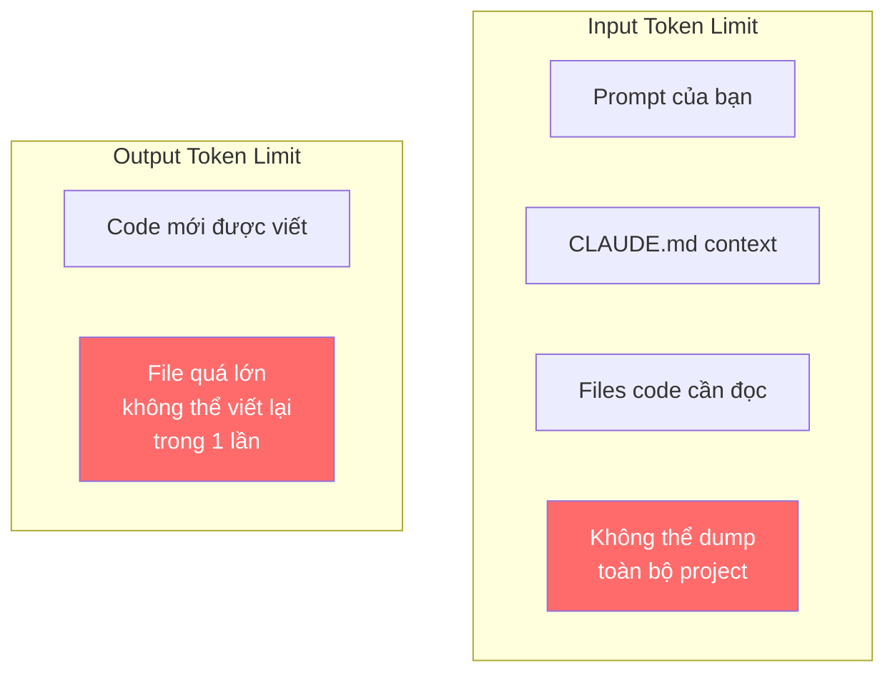
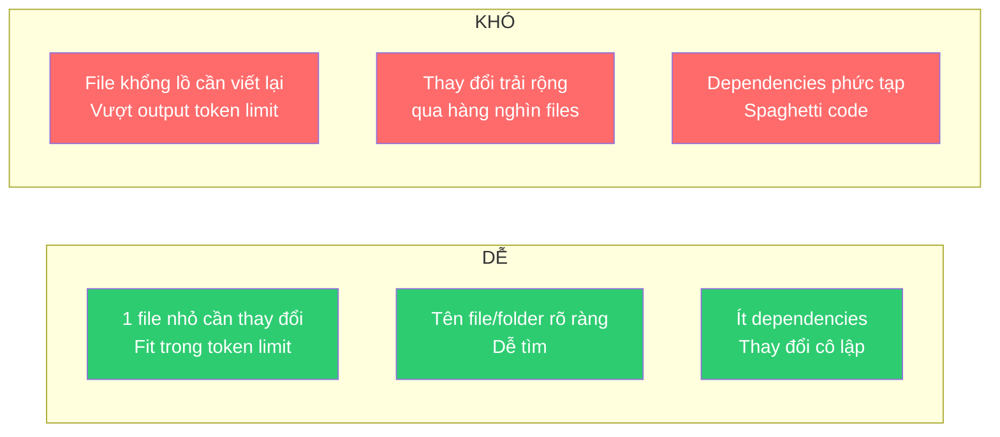
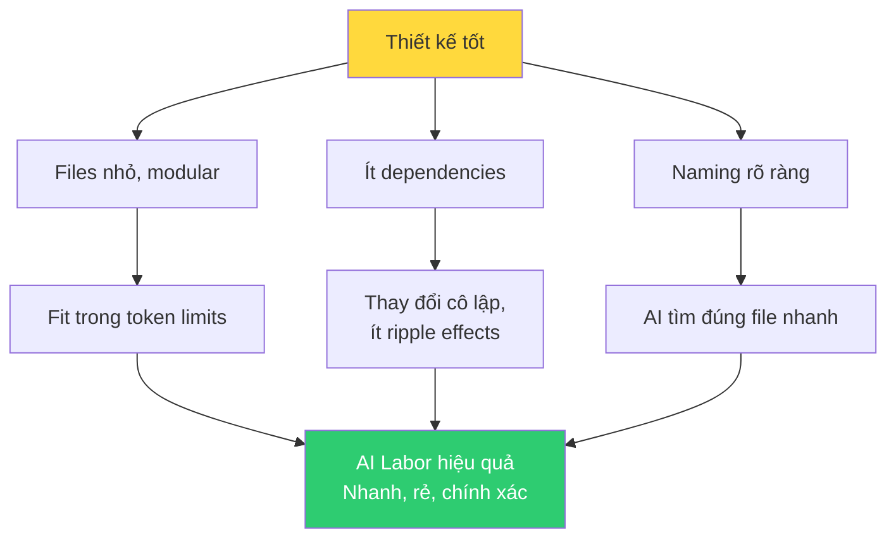
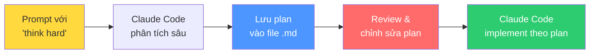
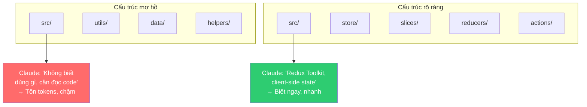
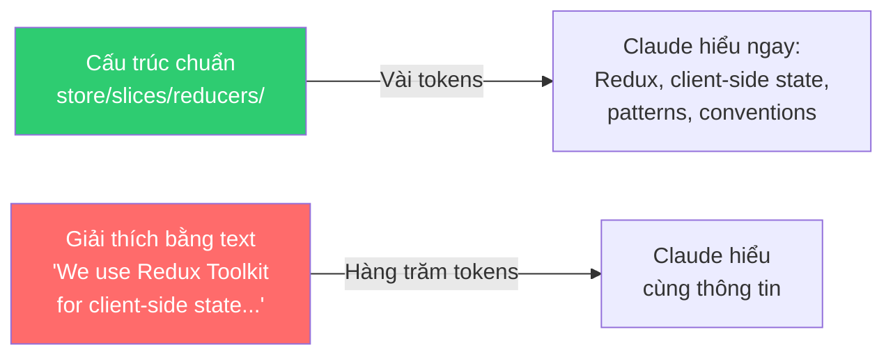

# Bài 3: Thiết kế phần mềm, Token Limits & Maintainability

## Nội dung chính

AI labor có vẻ kỳ diệu — cho nó bất cứ gì và nó sẽ làm. Đúng ở một mức độ, nhưng có **giới hạn cơ bản** mà chúng ta phải tính đến. Và những giới hạn đó ảnh hưởng đến thiết kế.

### Token Limits — Giới hạn cốt lõi

Khi bạn đưa prompt cho Claude Code, nó phải:
1. **Tìm ra files nào cần thay đổi** — không thể dump tất cả files vào model
2. **Đọc và hiểu code liên quan** — trong giới hạn input tokens
3. **Viết code mới** — trong giới hạn output tokens



AI luôn dùng một **"cửa sổ" (window)** để focus vào từng phần của codebase — giống như con người phải mở từng file để đọc.

### Điều gì dễ vs. khó cho AI?



### Thiết kế phần mềm VẪN quan trọng

> Rất dễ nghĩ rằng thiết kế phần mềm không còn quan trọng khi có AI. Nhưng nó thực sự quan trọng — thậm chí quan trọng hơn.

Tất cả nguyên tắc thiết kế tốt đều áp dụng:
- **Modular** — chia nhỏ thành modules/files có kích thước hợp lý
- **Single Responsibility** — mỗi file/module làm 1 việc
- **Low coupling** — ít dependencies giữa các phần
- **Clear naming** — tên file/folder phản ánh nội dung

Lý do: những nguyên tắc này giúp AI labor **nhanh hơn, chính xác hơn, và rẻ hơn** (ít tokens).



---

# Bài 4: Yêu cầu Claude Code suy nghĩ & lập kế hoạch trước

## Nội dung chính

### Think First, Code Second

Thường tốt hơn khi yêu cầu Claude Code **suy nghĩ trước khi hành động**. Bằng cách yêu cầu Claude phân tích vấn đề trước khi implement, bạn:
- Xác định vấn đề tiềm ẩn sớm
- Đánh giá nhiều phương án
- Thiết kế giải pháp robust trước khi viết code

> Sửa sai trong kế hoạch **NHANH hơn rất nhiều** so với undo quyết định implementation tồi.

### Extended Thinking Levels

Claude Code có các mức suy nghĩ sâu, kích hoạt bằng từ khóa:

| Từ khóa | Mức độ | Khi nào dùng |
|---|---|---|
| `think` | Cơ bản | Vấn đề đơn giản |
| `think hard` | Sâu hơn | Độ phức tạp trung bình |
| `think harder` | Toàn diện | Kịch bản phức tạp |
| `ultrathink` | Tối đa | Vấn đề cực kỳ phức tạp |

Mỗi mức cấp thêm tài nguyên tính toán để Claude đánh giá alternatives, xem xét edge cases, và phát triển giải pháp robust.

### Ví dụ prompt

```
Think hard about how to implement a machine learning-powered
expense categorization system that learns from user behavior
and suggests categories automatically.

1. What are the core technical challenges?
2. What data do we need to collect and how?
3. What ML approaches would work best?
4. How should we handle privacy and data security?
5. What's the user experience flow?
6. How do we handle edge cases and errors?
7. What's the deployment and maintenance strategy?

Provide a comprehensive technical analysis before we start coding.
Save the plan to development_plan.txt
```

### Lưu kế hoạch vào file

Yêu cầu Claude Code lưu plan vào file (ví dụ `FEATURE_PLAN.md`, `INTEGRATION_DESIGN.md`) để:
- Review offline
- Chia sẻ với team members
- Chỉnh sửa thêm constraints/requirements
- Tham chiếu trong quá trình phát triển
- Debug issues sau này
- Onboard team members mới



---

# Bài 5: Cấu trúc Project & Đặt tên File — Context quan trọng cho Scalability

## Nội dung chính

### Cấu trúc project = Context giàu thông tin

Mỗi khi nhận prompt, Claude Code phải **map prompt vào codebase** — tìm files nào cần thay đổi. Cấu trúc project và tên file là **thông tin đầu tiên** nó thấy.

### Thí nghiệm: 3 cấu trúc project, cùng 1 câu hỏi

Câu hỏi: "Project này dùng client-side state management hay server-state caching?"

| Cấu trúc | Claude trả lời được? |
|---|---|
| Cấu trúc chung chung, tên mơ hồ | ❌ "Không thể xác định chỉ từ folder structure" |
| Cấu trúc tốt hơn nhưng chưa rõ | ❌ "Cần xem code files thực tế" |
| Có `store/`, `slices/`, `reducers/`, `actions/` | ✅ "Client-side state management dùng Redux Toolkit" |



### Nguyên tắc cấu trúc project cho AI

1. **Dùng naming conventions chuẩn** — Claude được train trên code chuẩn, nên tên chuẩn = token-efficient
2. **Tên folder/file phản ánh nội dung** — `expense-dashboard/` thay vì `component-7/`
3. **Prompt khớp với cấu trúc** — nếu bạn nói "change expense dashboard" và có folder `expense-dashboard/`, Claude tìm ngay
4. **Tránh cấu trúc kỳ lạ** — custom naming không chuẩn = phải document thêm trong CLAUDE.md
5. **Tránh phân tán** — 1 feature nằm trong 10 folders khác nhau = Claude phải tìm rất lâu

### Token Efficiency của cấu trúc tốt



Cấu trúc project chuẩn truyền đạt **cùng lượng thông tin** nhưng tốn **ít tokens hơn nhiều** so với viết documentation.

---

## Kiến thức bổ sung: Checklist thiết kế cho AI-friendly codebase

| Tiêu chí | Tốt cho AI | Xấu cho AI |
|---|---|---|
| File size | < 300 dòng/file | > 1000 dòng/file |
| Dependencies | Ít, rõ ràng | Nhiều, circular |
| Naming | Chuẩn ngành (store, hooks, utils) | Custom, viết tắt khó hiểu |
| Feature location | 1 folder chứa toàn bộ feature | Phân tán qua nhiều folders |
| Coupling | Loose coupling | Tight coupling, spaghetti |
| Conventions | Theo framework standards | Custom conventions |

---

## Summary — Đúc rút kinh nghiệm Module 06

> **Module 06 dạy cách tối ưu scalability và reasoning của Claude Code.** (1) Là tay-mắt-tai khi cần, nhưng luôn tìm cách tự động hóa feedback loop. (2) Đặt quy trình tự kiểm tra trong CLAUDE.md — viết tests, compile, chạy trước khi commit. (3) Thiết kế phần mềm VẪN quan trọng — token limits đòi hỏi code modular, files nhỏ, ít dependencies. (4) Dùng "think hard/ultrathink" để Claude Code lập kế hoạch trước khi code — sửa plan nhanh hơn sửa code. (5) Cấu trúc project chuẩn = context giàu thông tin với ít tokens — tên file/folder chuẩn giúp Claude Code tìm đúng chỗ ngay lập tức.
