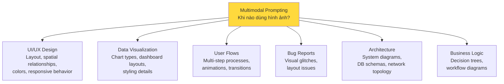
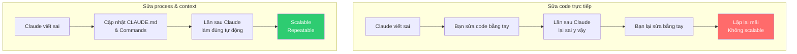
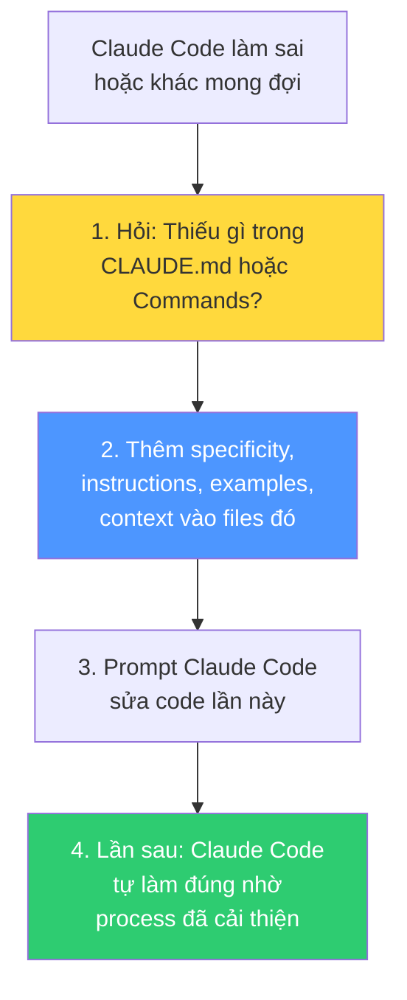
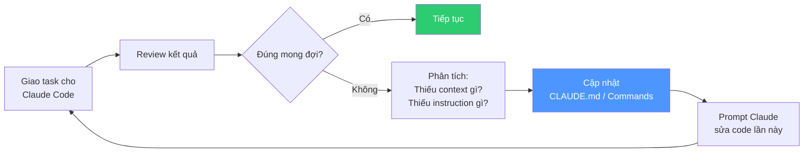
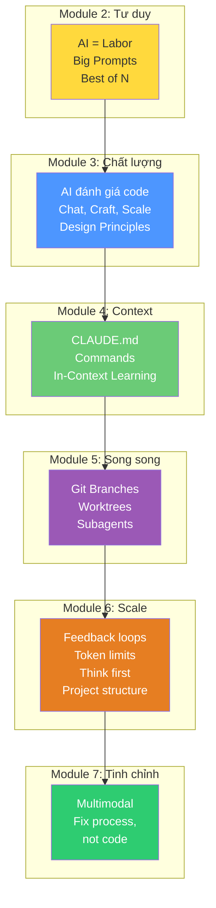

# Bài 1: Từ phác thảo trên khăn giấy đến Production Code — Multimodal Prompting

## Nội dung chính

### Kịch bản

Bạn đang ngồi quán cà phê, brainstorm cho expense tracker app. Cảm hứng ập đến — bạn chộp lấy khăn giấy và bắt đầu phác thảo ý tưởng cho dashboard "Expense Insights". Khăn giấy có vài vết cà phê? Không sao — Claude Code có thể biến cả những phác thảo lộn xộn nhất thành code production-ready.

### Bài tập: Biến phác thảo thành code

**Bước 1**: Lưu hình ảnh phác thảo (napkin mockup) vào project folder

**Bước 2**: Prompt Claude Code:

```
I sketched an expense insights dashboard on a napkin at a coffee shop.
Please implement this as a React component called MonthlyInsights.
Looking at this sketch: /your/path/to/napkin-insights-mockup.png
Implement a new screen in the application that mirrors what you see
in the mockup.
```

(Hoặc kéo-thả hình ảnh trực tiếp vào prompt area của Claude Code)

### Khi nào hình ảnh mạnh hơn text?



### So sánh: Text vs. Visual

| Tình huống | Text approach | Visual approach |
|---|---|---|
| **Layout** | "Search bar centered, logo 20px left, avatar 15px right, nav below with equal spacing..." | Wireframe → "Implement this layout exactly" |
| **Colors** | "Blue not too dark, not too light, professional but warmer, subtle gradient..." | Color palette → "Match these exact colors" |
| **Charts** | "Donut chart, hole 40% radius, 5 distinct colors, labels don't overlap..." | Sketch → "Create a chart like this" |
| **Bug report** | "Button text cut off, weird spacing, colors wrong, nav overlapping on mobile..." | Screenshot → "Fix what's wrong here" |
| **Architecture** | "Frontend → API gateway → 3 microservices, each with DB, message queue between..." | Diagram → "Implement this architecture" |

### Ứng dụng thực tế

- **Design handoffs**: Designer show mockup → Claude Code implement trực tiếp
- **Team whiteboard**: Chụp ảnh whiteboard sau meeting → Claude Code tạo prototypes trong lúc team nghỉ giải lao
- **Bug reports**: Screenshot + annotation >> mô tả text dài dòng
- **Stakeholder communication**: Prototype từ sketch → feedback tức thì
- **Documentation**: Visual examples hiệu quả hơn text thuần

---

# Bài 2: Bắt đầu bằng sửa Process & Context, không phải sửa Code

## Nội dung chính

### Tình huống không thể tránh

Khi bắt đầu dùng Claude Code, điều này **chắc chắn sẽ xảy ra**: Claude viết code không đúng ý bạn — sai style, sai thiết kế, không đúng mong đợi.

Bạn có vài lựa chọn:
1. Tự tay sửa code
2. Prompt Claude Code sửa trực tiếp
3. **Sửa CLAUDE.md và Commands** ← Đây là lựa chọn có giá trị nhất

### Tại sao sửa process thay vì sửa code?



> Bạn đang **lập trình AI labor** — bằng tiếng Anh (hoặc ngôn ngữ nào bạn dùng) thay vì ngôn ngữ lập trình truyền thống. CLAUDE.md và Commands là "source code" của process.

### Ẩn dụ: Sorting algorithm

Nếu bạn viết chương trình sort số, bạn có muốn nó dừng lại mỗi 10 số để hỏi bạn "đúng chưa"? Không — bạn sẽ viết chương trình sort đúng, đặt guardrails, test, và tinh chỉnh cho đến khi nó **tự chạy đúng**.

Đó chính xác là mindset bạn cần: tinh chỉnh CLAUDE.md và Commands cho đến khi process **tự chạy đúng** mà không cần bạn can thiệp.

### Quy trình khi Claude Code mắc lỗi



### Câu hỏi tự vấn mỗi khi sửa code

> "Tôi có thể thay đổi gì trong CLAUDE.md hoặc Commands để lần sau không phải sửa lỗi này nữa?"

Mỗi phút bạn dành để cải thiện CLAUDE.md và Commands = **đầu tư vào scalability**:
- Process lặp lại tốt hơn
- Code chất lượng cao hơn
- Bạn hands-off nhiều hơn
- AI labor scale xa hơn

### Vẫn nên prompt sửa code (không tự sửa tay)

Khi cần sửa code ngay, hãy **prompt Claude Code sửa** thay vì tự sửa tay. Vì:
- Prompt sửa giúp bạn hiểu **Claude cần context/instruction gì** để thấy lỗi
- Từ đó biết cần thêm gì vào CLAUDE.md/Commands
- Tự sửa tay = không học được gì cho process

---

## Kiến thức bổ sung: Vòng lặp cải tiến liên tục



Theo thời gian, CLAUDE.md và Commands của bạn sẽ trở thành **bộ institutional knowledge hoàn chỉnh** — và Claude Code sẽ ngày càng ít mắc lỗi hơn.

---

## Summary — Đúc rút kinh nghiệm Module 07 & Toàn khóa học

> **Module 07 đóng lại khóa học với 2 bài học quan trọng.** (1) Multimodal prompting: hình ảnh mạnh hơn text cho UI, charts, architecture, bug reports — chụp ảnh phác thảo/whiteboard và để Claude Code implement. (2) Bài học quan trọng nhất: khi Claude Code sai, sửa CLAUDE.md và Commands TRƯỚC, sửa code SAU. Bạn đang lập trình AI labor — CLAUDE.md và Commands là source code của process. Mỗi lần cải thiện chúng = đầu tư vào scalability, repeatability, và chất lượng dài hạn.

---

## Tổng kết toàn khóa học



> **Từ developer viết code → CEO điều phối AI labor.** Tư duy lớn (Big Prompts, Best of N) → Đảm bảo chất lượng (Chat, Craft, Scale) → Xây dựng context (CLAUDE.md, Commands, Examples) → Phát triển song song (Branches, Worktrees, Subagents) → Tối ưu scalability (Token limits, Think first, Project structure) → Cải tiến liên tục (Fix process, not code). Đó là hành trình từ 1x đến 1000x.
